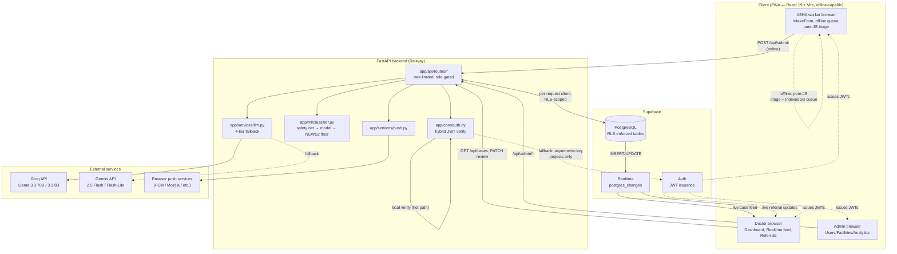
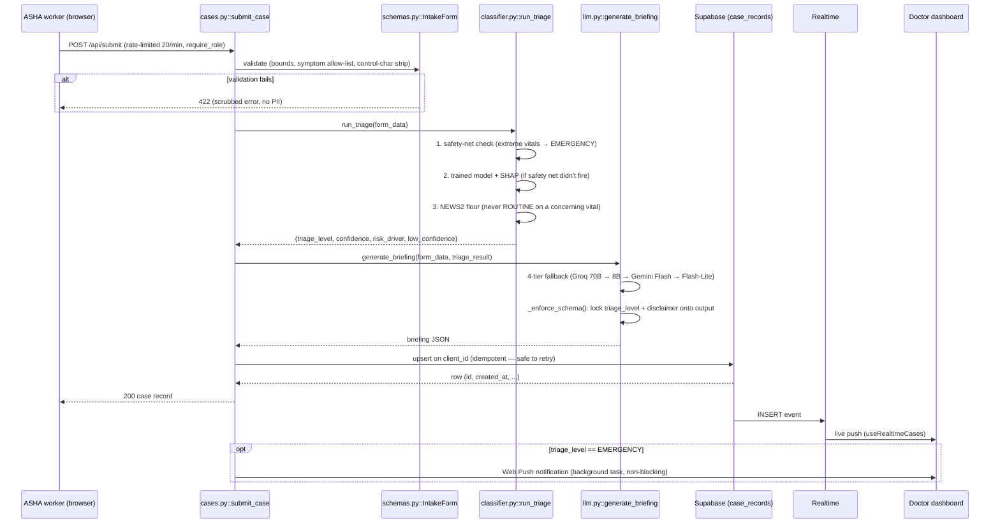
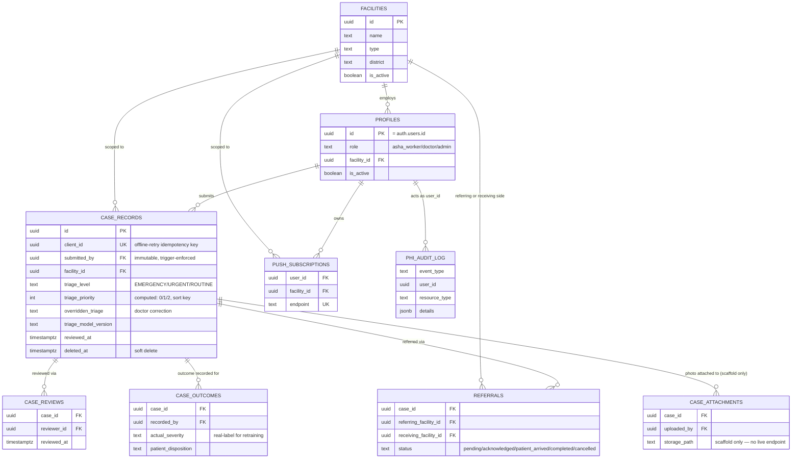
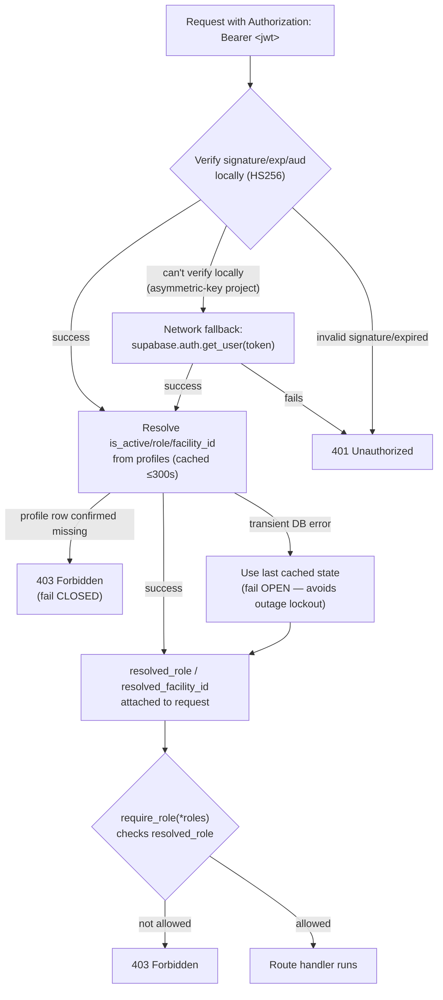

# VitalNet — Codebase Map

**Purpose of this document**: a single, current, high-signal reference so a
future contributor (human or AI agent) can orient in VitalNet without
re-reading the entire codebase. If you make a structural change (new
directory, new major module, a file moves, a data flow changes), **update
this document in the same commit**. Stale maps are worse than no map —
see the "Keeping this document current" section at the bottom for the
specific rule.

Last verified against the codebase: 2026-07-04 (post round-3 reconciliation —
merged an independently-developed `dev` branch's security/reliability work
on top of round-2's hybrid auth, pure-JS offline engine, and ML safety
layers; see git log for the full change list).

---

## 1. What VitalNet is, in one paragraph

An offline-first clinical triage PWA for rural Indian healthcare. ASHA
(community health) workers fill out a patient intake form — works with or
without connectivity, and requires explicit patient-consent capture before
submission. A local ML classifier (same model, running either in Python
server-side or as a pure-JS tree evaluator in the browser — no
onnxruntime-web, see Option 6 in the ML README) instantly assigns EMERGENCY /
URGENT / ROUTINE, backed by a deterministic safety net that can never be
overridden. An LLM (Groq, with Gemini fallback) generates a structured
clinical briefing for the case. Doctors see a real-time, priority-sorted
dashboard of incoming cases, see low-confidence/review-requested flags, and
mark cases reviewed (soft-deletable, audit-logged). Admins manage users and
facilities. Three roles (asha_worker, doctor, admin), enforced by both
backend checks (role/facility_id resolved fresh from the `profiles` table
every request — never trusted from JWT claims) and Supabase Row Level
Security.

### System architecture



## 2. Repository layout

```
VitalNet/
├── backend/            FastAPI Python app — see §3. Migrations live in
│                       backend/supabase/migrations/ (version-controlled,
│                       idempotent SQL — the canonical schema source; see §5)
├── frontend/           React 19 + Vite PWA — see §4
├── docs/
│   ├── DISASTER_RECOVERY.md   Ops runbook: RTO/RPO targets, restore procedures
│   ├── INCIDENT_RESPONSE.md   Security incident runbook: severity classification,
│   │                     detection → containment → eradication → post-incident
│   │                     review, DPDP breach-notification hook (distinct from
│   │                     DISASTER_RECOVERY.md — adversary-involved vs. not)
│   ├── CLINICAL_GOVERNANCE.md Regulatory posture (CDSCO SaMD), model lifecycle
│   │                     governance, five-layer guardrail architecture
│   ├── COMPLIANCE_DPDP.md     India DPDP Act 2023 mapping — data-principal
│   │                     rights, fiduciary obligations, honest gap list
│   ├── ACCESSIBILITY.md       WCAG 2.1 AA audit — label association, live
│   │                     regions, color-contrast fixes, honest known gaps
│   ├── SLO.md                 Service level objectives, SLIs, GET /api/metrics
│   │                     (Prometheus), example PromQL/scrape config
│   ├── security-audits/       Historical red-team audit trail (dated folders).
│   │                     Read-only historical record — do not treat findings as
│   │                     current state without cross-checking the code.
│   └── {ARCHITECTURE_RESTRUCTURE,REBUILD_INSTRUCTIONS,IMPROVEMENTS}.md
│                         Historical execution logs from past hardening phases — all
│                         marked [!NOTE] superseded-by-this-file at the top. Useful
│                         for "why is it built this way" archaeology, not "what does
│                         it do today." (Relocated here from repo root to declutter it —
│                         still linked from AGENTS.md/FEATURES_ROADMAP.md where cited.)
├── colab/              Legacy Google Colab training script — historical reference only,
│                       NOT wired into the app, trains on only 14 raw features (predates
│                       ClinicalFeatureEngineer). Do not use its output as a production model.
├── Context/            Only test_credentials.md remains (linked from AGENTS.md/
│                       README.md for E2E test account setup). The rest of this
│                       directory's historical phase-by-phase planning documents was
│                       removed as fully superseded by this file / FEATURES_ROADMAP.md —
│                       recoverable from git history if ever needed.
├── .github/
│   ├── workflows/ci.yml  Lint (PR) + pytest/build (push) on main and dev, plus an
│   │                     SBOM job (push-only, CycloneDX for backend+frontend deps,
│   │                     uploaded as a build artifact — docs/SECURITY.md)
│   └── dependabot.yml    Daily pip/npm/actions update PRs, targeting dev
├── README.md           Setup, features, deployment — start here
├── AGENTS.md           Conventions for coding agents working in this repo
├── CODEBASE_MAP.md     This file
└── FEATURES_ROADMAP.md Proposed feature backlog with implementation-ready specs
```

## 3. Backend (`backend/`)

FastAPI, Python 3.13 (target; 3.11+ works for local dev), Supabase
(PostgreSQL + Auth + Realtime) as the only database, Groq/Gemini for LLM
briefings, scikit-learn for ML triage.

```
backend/
├── app/
│   ├── main.py                     Entry point ONLY: logging setup, DB schema-
│   │                                compatibility gate + lifespan (loads the ML
│   │                                classifier, degraded/rules-only boot on failure),
│   │                                middleware stack (rate limiter, GZip, CSRF +
│   │                                X-Device-Id guard, security headers, correlation
│   │                                ID, CORS), router registration, global exception
│   │                                handlers (PII-scrubbed validation errors),
│   │                                role-gated /api/health. No route logic lives here.
│   ├── core/
│   │   ├── config.py                Pydantic Settings — all env vars, fails fast at
│   │   │                            import if required vars are missing. Includes:
│   │   │                            jwt_local_verification, revocation_recheck_seconds,
│   │   │                            rate_limit_storage_uri, environment (gates HSTS/
│   │   │                            dev CORS origins/whether .env.local loads at all),
│   │   │                            api_docs_enabled, csrf_token, cors_allowed_origins.
│   │   ├── auth.py                  HYBRID JWT verification: verifies signature/
│   │   │                            exp/aud LOCALLY (HS256 via jwt_secret) on the
│   │   │                            hot path — no Supabase round-trip per request —
│   │   │                            with a network get_user() fallback for
│   │   │                            asymmetric-key projects. Every request resolves
│   │   │                            is_active/role/facility_id fresh from `profiles`
│   │   │                            (one combined query, short-TTL cached per user) —
│   │   │                            NEVER trusts JWT user_metadata for these, since
│   │   │                            it's client-settable and can go stale. Fails
│   │   │                            CLOSED on a confirmed-missing profile, OPEN only
│   │   │                            on a transient DB error. get_current_user() sets
│   │   │                            resolved_role/resolved_facility_id on the returned
│   │   │                            dict; require_role(*roles) reads resolved_role.
│   │   │                            Also exposes verify_sub_for_rate_limit().
│   │   ├── database.py              Three Supabase clients: supabase_anon (public
│   │   │                            reads), get_supabase_for_user() (RLS-scoped, a
│   │   │                            FRESH client per request — deliberate: a shared
│   │   │                            client with a mutated per-request auth token
│   │   │                            would race across concurrent requests and leak
│   │   │                            one user's data to another), supabase_admin
│   │   │                            (service_role, auth.admin.* AND admin-only
│   │   │                            cross-tenant ops — require_role('admin') is the
│   │   │                            only access boundary, no RLS backstop).
│   │   │                            extract_bearer_token() validates header format
│   │   │                            before any signature check. validate_schema_
│   │   │                            compatibility() is the startup gate.
│   │   ├── audit.py                  PHI access audit logging (log_phi_access,
│   │   │                            AuditEventType, get_client_ip) — writes to
│   │   │                            BOTH the dedicated 'vitalnet.audit' logger
│   │   │                            AND the phi_audit_log Postgres table
│   │   │                            (best-effort, non-blocking insert via
│   │   │                            supabase_admin) — viewable via GET
│   │   │                            /api/admin/audit-log / AdminAuditLog.jsx.
│   │   ├── correlation.py            Single contextvar for X-Request-ID, shared by
│   │   │                            the logging formatter and route handlers.
│   │   ├── logging.py                JSON structured logging setup (setup_logging()),
│   │   │                            includes correlation_id via CorrelationIdFilter.
│   │   └── metrics.py                Prometheus counters/histogram (docs/SLO.md):
│   │                                 request count/latency by method+route+status,
│   │                                 triage classifications by level. record_request()
│   │                                 called from main.py's MetricsMiddleware, keyed on
│   │                                 the matched ROUTE TEMPLATE (never the raw path —
│   │                                 unbounded-cardinality footgun).
│   ├── api/routes/
│   │   ├── cases.py                  /api/submit, /api/cases, /api/cases/{id}/review,
│   │   │                             /api/cases/mine, /api/cases/{id}. Owns the shared
│   │   │                             slowapi `limiter` instance (imported by the other
│   │   │                             route modules) keyed on the verified JWT sub.
│   │   │                             Cursor pagination has an id tie-breaker for
│   │   │                             stability across equal timestamps. Row-level
│   │   │                             authorization via _authorize_case_row_access()
│   │   │                             (admin global, doctor facility-scoped, asha_worker
│   │   │                             own-submissions-only — also used by security.py).
│   │   │                             Every create/read/update is PHI-audit-logged.
│   │   ├── admin_routes.py           /api/admin/* — user CRUD (password complexity
│   │   │                             policy, orphan rollback on profile-provisioning
│   │   │                             failure, profile/auth-metadata rollback on
│   │   │                             partial failure), facility CRUD (optimistic-
│   │   │                             concurrency toggle), system stats, audit-log
│   │   │                             view, and POST /api/admin/users/bulk (CSV
│   │   │                             onboarding — reuses _provision_user() per row,
│   │   │                             one bad row doesn't fail the batch). All
│   │   │                             admin-only (require_role('admin')), all
│   │   │                             rate-limited and PHI-audit-logged.
│   │   ├── analytics_routes.py       /api/analytics/* — aggregate stats, EMERGENCY
│   │   │                             rate trend, response-time SLA (median/p90/
│   │   │                             overdue per tier), ML/doctor agreement rate,
│   │   │                             and a case CSV export (streamed, PHI-audit-
│   │   │                             logged as bulk egress). Facility-scoped for
│   │   │                             'doctor', global for 'admin' (GLOBAL_SCOPE_ROLE
│   │   │                             constant). Queries run concurrently
│   │   │                             (asyncio.gather over asyncio.to_thread) with a
│   │   │                             per-query timeout and graceful degradation
│   │   │                             (_degraded flag) instead of failing the whole
│   │   │                             dashboard on one slow query.
│   │   ├── security.py               DELETE /api/security/cases/{id} — soft-delete
│   │   │                             (sets deleted_at, requires X-Device-Id), reuses
│   │   │                             cases.py's row-level authz helper. PHI-audit-logged.
│   │   ├── push_routes.py            Web Push subscribe/unsubscribe, GET
│   │   │                             /api/facilities (doctor-accessible target
│   │   │                             picker), and the unreviewed-EMERGENCY re-alert
│   │   │                             endpoint (POST /api/push/check-emergency-
│   │   │                             escalations — idempotent, meant to be driven by
│   │   │                             an external scheduler/cron). Send logic lives
│   │   │                             in app/services/push.py to avoid a circular
│   │   │                             import with cases.py.
│   │   ├── referral_routes.py        Inter-facility referral workflow — POST
│   │   │                             /api/cases/{id}/refer, GET /api/referrals,
│   │   │                             PATCH /api/referrals/{id}/status (forward-only
│   │   │                             state machine, receiving-facility-only).
│   │   ├── dsr_routes.py             DPDP data-subject-request lifecycle
│   │   │                             (docs/COMPLIANCE_DPDP.md), admin-only, scoped
│   │   │                             to a single case_id: GET .../export (right to
│   │   │                             access), POST .../erase (right to erasure —
│   │   │                             redacts identifying fields, never touches the
│   │   │                             immutable case_outcomes table), POST
│   │   │                             .../purge-expired (retention sweep, external-
│   │   │                             scheduler-driven like the re-alert endpoint).
│   │   ├── voice_routes.py           POST /api/voice/transcribe — Groq Whisper voice
│   │   │                             transcription (app/services/voice.py). Online-only,
│   │   │                             no audio persisted; the browser-STT path is the
│   │   │                             fallback, not this (docs/DECISIONS.md §15).
│   │   └── metrics_routes.py         GET /api/metrics — Prometheus text format
│   │                                 (app/core/metrics.py), admin-only. Backs the
│   │                                 SLIs in docs/SLO.md.
│   ├── models/schemas.py            Pydantic request/response models. IntakeForm is
│   │                                 the case-submission contract — every field is
│   │                                 bounded (min/max length, numeric ranges, enums),
│   │                                 free-text fields are control-character-stripped,
│   │                                 symptoms are allow-listed, and consent_captured
│   │                                 must be true (server-enforced, not just UI).
│   │                                 human_review_requested/reason let an ASHA worker
│   │                                 flag a case for review independent of ML tier.
│   │                                 If you add a field here, add a matching bound to
│   │                                 frontend/src/utils/validation.js.
│   ├── ml/
│   │   ├── README.md                 ML architecture + clinical grounding — READ
│   │   │                             before touching classifier.py / clinical_features.py.
│   │   ├── MODEL_CARD.md              Intended use, metrics (and what they do/don't
│   │   │                             mean), limitations, ethics — the honest record.
│   │   ├── classifier.py             Public ML API: load_classifier(), predict_triage()
│   │   │                             / run_triage(), get_classifier_info(). Three
│   │   │                             layers per prediction: (1) _safety_net_check →
│   │   │                             EMERGENCY for extreme vitals/critical symptoms,
│   │   │                             (2) the trained model, (3) _news2_concerning_vital
│   │   │                             floor → never ROUTINE on a concerning vital. Also
│   │   │                             attaches contraindication_flags (below) and emits
│   │   │                             a low_confidence abstention flag.
│   │   ├── contraindications.py      check_contraindications() — free-text keyword-
│   │   │                             matched flags (NSAID+renal, ACE-inhibitor+renal,
│   │   │                             metformin+vomiting, anticoagulant+bleeding, beta-
│   │   │                             blocker+bradycardia, insulin+altered-consciousness).
│   │   │                             Advisory, not a drug-interaction database — see
│   │   │                             docs/DECISIONS.md §17. Never changes triage tier;
│   │   │                             cases.py folds any flag into needs_review. Mirrored
│   │   │                             in JS clinicalRules.js::checkContraindications.
│   │   ├── clinical_features.py     ClinicalFeatureEngineer — expands ~14 raw intake
│   │   │                             fields into 45 engineered features. MIRRORED in
│   │   │                             JS (frontend triageClassifier.js). The safety
│   │   │                             net + floor + contraindication flags are mirrored
│   │   │                             in JS clinicalRules.js. Change one side → change
│   │   │                             the other → retrain → `npm run test:parity`
│   │   │                             (CI-enforced).
│   │   └── models/triage_classifier.pkl
│   │                                 The trained model + SHAP explainer bundle.
│   │                                 Regenerate via scripts/train_classifier.py — never
│   │                                 hand-edit.
│   ├── services/
│   │   ├── llm.py                    4-tier LLM fallback (Groq 70B → Groq 8B → Gemini
│   │   │                             Flash → Gemini Flash-Lite) for clinical briefings.
│   │   │                             triage_level and disclaimer are hard-locked onto
│   │   │                             every LLM output regardless of tier
│   │   │                             (_enforce_schema()) — no LLM call can change the
│   │   │                             triage decision. Free-text patient fields are
│   │   │                             sanitised before entering the prompt
│   │   │                             (_sanitize_field()) to resist prompt injection.
│   │   ├── push.py                   Web Push send logic (push_emergency_alert,
│   │   │                             _send_one) — separate module from push_routes.py
│   │   │                             specifically to avoid a circular import with
│   │   │                             cases.py. No-ops silently if VAPID keys aren't
│   │   │                             configured. Deletes a subscription on a 410-Gone
│   │   │                             send response (stale subscription cleanup).
│   │   ├── sms.py                    SMS fallback SCAFFOLDING ONLY (FEATURES_ROADMAP
│   │   │                             §3.1) — SmsGateway protocol, NullSmsGateway
│   │   │                             (logs instead of sending), parse_inbound_sms()
│   │   │                             strict-format parser. No live webhook endpoint —
│   │   │                             see docs/DECISIONS.md §11.
│   │   └── voice.py                  Groq Whisper transcription (transcribe()) behind
│   │                                 voice_routes.py. i18n language codes map directly
│   │                                 onto Whisper's ISO-639-1 codes. Audio is transcribed
│   │                                 and discarded, never persisted (docs/DECISIONS.md §15).
│   └── __init__.py files (package markers, no logic)
├── scripts/
│   ├── train_classifier.py          THE training entrypoint (single unified model —
│   │                                 see app/ml/README.md). One run outputs the
│   │                                 backend .pkl, frontend triage_trees.json +
│   │                                 features_config.json, and the golden-vector
│   │                                 fixture; asserts pkl==onnx==tree-JSON parity;
│   │                                 reports 5-fold CV + calibration (ECE).
│   ├── tree_export.py                Converts the (in-memory) ONNX tree ensemble to
│   │                                 the compact triage_trees.json + a Python
│   │                                 reference evaluator used for the parity assert.
│   ├── export_golden_vectors.py      Generates tests/fixtures/golden_feature_vectors.json
│   │                                 (240 synthetic patients, fixed seed) — the ground
│   │                                 truth for test_feature_parity.py AND
│   │                                 featureParity.test.mjs. Freezes datetime.now() to a
│   │                                 fixed reference (see docs/DECISIONS.md §12) so the
│   │                                 two time-dependent engineered features don't make
│   │                                 the fixture flaky.
│   ├── retrain_from_outcomes.py      Retraining pipeline reading real case_outcomes +
│   │                                 overridden_triage labels (FEATURES_ROADMAP §1.3),
│   │                                 blended with a shrinking proportion of synthetic
│   │                                 data. Reports an agreement-rate delta vs. the
│   │                                 production model. NEVER touches the production
│   │                                 .pkl or auto-deploys — saves a candidate file only;
│   │                                 promotion is a manual, human-gated step.
│   ├── fairness_audit.py             Subgroup (age band × sex) accuracy/EMERGENCY-recall
│   │                                 report on a fresh synthetic eval set, run through
│   │                                 the FULL pipeline (safety net + model + NEWS2
│   │                                 floor). Operator-run, not scheduled/CI — see
│   │                                 app/ml/README.md.
│   ├── drift_monitor.py              Population Stability Index per engineered feature,
│   │                                 live case_records vs. the synthetic training
│   │                                 distribution. Needs a real Supabase project.
│   │                                 Operator-run, not scheduled/CI.
│   └── load_test.py                  asyncio+httpx load generator (no new dependency —
│                                     httpx is already required). Refuses to target
│                                     anything but localhost without
│                                     --confirm-non-local — see docs/INCIDENT_RESPONSE.md.
│                                     Operator-run, not CI.
├── prompts/clinical_system_prompt.txt
│                                     System prompt for the LLM briefing generator.
├── tests/
│   ├── conftest.py                   Sets fallback fake (JWT-format) Supabase creds so
│   │                                 unit tests run offline; real CI secrets win.
│   ├── test_direct.py                Classifier smoke tests, no server/DB required.
│   ├── test_classifier_safety.py     Property tests for the safety guarantees (extreme
│   │                                 vitals → EMERGENCY; concerning vital never ROUTINE;
│   │                                 low_confidence present). Run in CI.
│   ├── test_contraindications.py     Unit tests for check_contraindications() — one
│   │                                 positive/negative case per rule, plus predict_
│   │                                 triage() integration (flags present on both the
│   │                                 safety-net and model-decision exit paths).
│   ├── test_admin_authz.py           Asserts every /api/admin route — across
│   │                                 admin_routes.py AND dsr_routes.py (see
│   │                                 ADMIN_ROUTE_MODULES) — is require_role('admin')-
│   │                                 guarded (the only boundary on the RLS-bypassing
│   │                                 service-role client). Run in CI.
│   ├── test_feature_parity.py        Python half of the online/offline ML parity
│   │                                 guarantee — replays golden_feature_vectors.json
│   │                                 through ClinicalFeatureEngineer. JS half is
│   │                                 frontend/tests/featureParity.test.mjs. Both freeze
│   │                                 the clock (docs/DECISIONS.md §12). Run in CI.
│   ├── test_bulk_user_import.py      Row-isolation and orphaned-auth-user-rollback
│   │                                 tests for admin_routes.py's _provision_user() —
│   │                                 one bad CSV row must not fail the whole batch.
│   ├── test_sms_parser.py            Unit tests for the SMS scaffolding's fixed-format
│   │                                 parser (app/services/sms.py) — pure logic, no
│   │                                 DB/network mocking needed.
│   ├── test_dsr_routes.py            Unit tests for dsr_routes.py's plain helper
│   │                                 functions — redaction field coverage, deleted_at
│   │                                 idempotency, and that case_outcomes is never
│   │                                 written (immutable-by-design invariant).
│   ├── test_voice_transcription.py   Unit tests for app/services/voice.py — not-
│   │                                 configured error, language-code pass-through/
│   │                                 fallback-to-None, Groq-failure wrapping. Uses
│   │                                 asyncio.run() directly (no pytest-asyncio dep).
│   └── test_e2e.py                   Full integration test against a running server +
│                                     real Supabase auth (needs seeded test users).
│                                     NOT run in unit CI (needs a live server).
├── seed_user.py                      One-off script to create/fix a test doctor
│                                     account. Mutates your Supabase project directly.
├── requirements.txt                  Runtime dependencies. scikit-learn and shap are
│                                     pinned to EXACT versions — see the comments in
│                                     the file and app/ml/README.md for why.
├── requirements-train.txt            ONLY needed to run scripts/train_classifier.py
│                                     (skl2onnx, onnxruntime) — NOT installed in
│                                     production; keeps the deploy footprint small.
├── Procfile / railway.toml / runtime.txt
│                                     Railway deployment config.
└── CLASSIFIER_CHANGELOG.md           ML model version history.
```

### Backend request lifecycle (submit case, the core flow)



1. `POST /api/submit` (`cases.py::submit_case`) — rate-limited 20/min/user,
   `require_role('asha_worker', 'admin')`.
2. `IntakeForm` Pydantic validation (bounds, symptom allow-list, control-char
   stripping).
3. `run_triage(form_data)` (`classifier.py`) — safety-net check first, then
   the trained model + SHAP explanation if the safety net didn't trigger.
4. `generate_briefing(form_data, triage_result)` (`llm.py`) — 4-tier LLM
   fallback; triage_level is locked onto the output regardless of which
   tier (or none) succeeded.
5. Upserted into `case_records` via a user-scoped Supabase client
   (`get_supabase_for_user`) using `client_id` as the idempotency key
   (`on_conflict="client_id", ignore_duplicates=True"`) — this is what makes
   offline-queue retries safe.
6. Supabase Realtime pushes the INSERT to any subscribed doctor dashboards
   (`useRealtimeCases` on the frontend).

## 4. Frontend (`frontend/`)

React 19, Vite 7, Tailwind CSS v4, `vite-plugin-pwa` for offline/installable
support, no TypeScript (plain `.jsx`/`.js`).

```
frontend/src/
├── main.jsx                  Entry point — mounts <App/>, imports i18n.js (must run
│                              before render), registers the PWA service worker.
├── i18n.js                    react-i18next init (FEATURES_ROADMAP §2.1). Persists the
│                              chosen language to localStorage, updates
│                              document.documentElement.lang. See docs/DECISIONS.md §10
│                              for why hi/ta are English placeholders, not real
│                              translations, and locales/README.md for the same.
├── locales/
│   ├── en.json                 Source of truth for every i18n key.
│   ├── hi.json, ta.json         Byte-for-byte copies of en.json pending clinician review.
│   └── README.md                Explains the placeholder status — read before "finishing"
│                              a translation yourself.
├── App.jsx                   Role-based routing (no react-router — just profile.role
│                              branching). Panels are React.lazy()-loaded per role so a
│                              given user only downloads their own panel's code.
├── store/authStore.jsx       AuthProvider/useAuth — Supabase session + profile state.
│                              Profile fetch joins facilities(phone) and caches it to
│                              localStorage (vn_facility_phone) — the one piece of
│                              profile data that must survive an offline reload, for
│                              EmergencySmsAlert.jsx (docs/DECISIONS.md §14).
├── lib/
│   ├── supabase.js            Supabase client — IndexedDB-backed session storage
│   │                          (survives memory pressure better than localStorage on
│   │                          low-RAM Android tablets).
│   ├── api.js                 Backward-compat barrel re-exporting from api/*.js and
│   │                          stores/syncStore.js — prefer importing from the
│   │                          specific module directly in new code.
│   ├── connectivity.js        isServerReachable() — real backend health-check probe,
│   │                          NOT navigator.onLine (which only checks local interface,
│   │                          not actual backend reachability — critical for rural
│   │                          satellite-link scenarios).
│   ├── offlineQueue.js        IndexedDB submission queue (enqueue/dequeue/getAllQueued),
│   │                          shared DB with useDraftSave.js.
│   └── push.js                 Web Push subscription helper — requests Notification
│                              permission, subscribes via pushManager.subscribe(), POSTs
│                              to /api/push/subscribe. Never throws; the caller (PushPrompt)
│                              treats decline/unsupported as a normal, expected outcome.
├── stores/syncStore.js        submitCase() (online+offline paths) and processQueue()
│                              (drains the offline queue with a paced delay to stay
│                              under the backend rate limit).
├── api/{auth,cases,admin,analytics,referrals,voice}.js
│                              Stateless fetch wrappers per domain, all via authHeaders().
│                              voice.js strips Content-Type from authHeaders() before a
│                              multipart upload so fetch can set its own boundary.
├── hooks/
│   ├── useLocalTriage.js      Wires up offline-model warmup (triggered on offline/
│   │                          unreachable events) and classify().
│   ├── useDraftSave.js        Auto-saves IntakeForm state to IndexedDB keyed by
│   │                          client_id (survives tab eviction on low-RAM devices).
│   ├── useRealtimeCases.js    Supabase Realtime subscription wrapper (INSERT/UPDATE),
│   │                          used by Dashboard, ASHAPanel history, AnalyticsDashboard.
│   ├── useRealtimeReferrals.js Same pattern, but binds TWO postgres_changes filters
│   │                          (referring_facility_id / receiving_facility_id) since a
│   │                          facility can be on either side of a referral.
│   └── useVoiceInput.js       Voice-to-text — tries server-side Groq Whisper
│                              (MediaRecorder + POST /api/voice/transcribe, the
│                              accuracy layer for Indic medical speech) first, falls
│                              back to the browser's own SpeechRecognition only if
│                              MediaRecorder/mic access is unavailable or the server
│                              call fails. BOTH paths need connectivity — the browser
│                              engine also calls a network speech API — so availability
│                              is still gated on navigator.onLine either way
│                              (docs/DECISIONS.md §15).
├── utils/
│   ├── triageClassifier.js    Offline triage orchestrator (NO onnxruntime). Loads
│   │                          /models/triage_trees.json + features_config.json;
│   │                          layered: safetyNetCheck → tree eval → NEWS2 floor →
│   │                          low_confidence, with a rules-only fallback if the model
│   │                          can't load (triage never fails). buildFeatureMap()
│   │                          MIRRORS backend clinical_features.py; feature ORDER is
│   │                          fetched from features_config.json (never hard-coded).
│   ├── treeEvaluator.js       ~120-line dependency-free evaluator for the tree JSON —
│   │                          a 1:1 port of scripts/tree_export.py::evaluate_tree_json.
│   ├── clinicalRules.js       safetyNetCheck() + news2ConcerningVital() — 1:1 mirror
│   │                          of the deterministic rules in classifier.py.
│   ├── validation.js          Zod schema — MUST mirror the bounds in
│   │                          backend/app/models/schemas.py::IntakeForm.
│   └── imageCompression.js    Photo-attachment SCAFFOLDING (FEATURES_ROADMAP §3.2) —
│                              canvas-based resize-to-1024px + JPEG re-encode. Not wired
│                              into any upload flow yet (no live endpoint exists — see
│                              docs/DECISIONS.md §11); vendor-independent and ready.
├── pages/
│   ├── LoginPage.jsx, IntakeForm.jsx, Dashboard.jsx
├── panels/
│   ├── ASHAPanel.jsx (New Case / My Submissions), DoctorPanel.jsx (Pending Review /
│   │   All Cases / Referrals tabs), AdminPanel.jsx (Analytics/Users/Facilities/System/
│   │   Audit Log)
├── components/                Shared UI: BriefingCard (triage override + outcome-
│   │                          recording + referral actions live here), TriageBadge,
│   │                          NavBar (includes the language switcher), OfflineBanner,
│   │                          ToastProvider, RouteGuard, ErrorBoundary, SkeletonCard,
│   │                          UpdatePrompt (PWA update-available prompt), PushPrompt
│   │                          (dismissible Web Push opt-in, shown once via localStorage),
│   │                          VoiceInputButton (mic button, renders nothing on
│   │                          unsupported browsers), ReferralsPanel (outgoing/incoming
│   │                          referral list with live status-advance actions),
│   │                          AnalyticsDashboard (includes the CSV export control),
│   │                          EmergencySmsAlert (offline-emergency sms: URI intent —
│   │                          shown in IntakeForm's queued-result view when the local
│   │                          triage is EMERGENCY; PHI-free fixed message body, see
│   │                          docs/DECISIONS.md §14), AmbulanceCallButton (tel:108
│   │                          intent, shown alongside the EMERGENCY result online AND
│   │                          offline — docs/DECISIONS.md §16 on why this is a phone
│   │                          call and not a dispatch integration).
│   └── admin/                 AdminUsers (includes the CSV bulk-import upload/preview
│                              flow), AdminFacilities, AdminStats, AdminAuditLog.
public/
│   ├── sw-push.js               Web Push `push`/`notificationclick` handlers, injected
│   │                            into the Workbox-generated service worker via
│   │                            workbox.importScripts in vite.config.js.
│   └── models/
│       ├── triage_trees.json    Compact tree ensemble (~1 MB), walked in pure JS.
│       └── features_config.json Canonical feature-order manifest.
                                 Both exported by scripts/train_classifier.py.
tests/
│   ├── treeParity.test.mjs      `npm run test:parity` — asserts the JS evaluator
│   │                            matches the server model on golden vectors (CI).
│   ├── featureParity.test.mjs   `npm run test:feature-parity` — asserts buildFeatureMap()
│   │                            matches ClinicalFeatureEngineer. Freezes the global Date
│   │                            constructor (see docs/DECISIONS.md §12). CI.
│   ├── contraindications.test.mjs `npm run test:contraindications` — asserts
│   │                            checkContraindications() (clinicalRules.js) agrees with
│   │                            app/ml/contraindications.py on flag count per case. CI.
│   ├── offline.spec.js          Playwright E2E: login → offline → submit → reconnect →
│   │                            sync. Needs a running dev server + seeded test users;
│   │                            not part of the unit-test CI job.
│   └── fixtures/
│       ├── golden_vectors.json          py-labelled tree-eval vectors, written by training.
│       └── golden_feature_vectors.json  py-labelled feature-engineering vectors, written
│                                        by scripts/export_golden_vectors.py.
```

### Frontend build-size notes (see FEATURES_ROADMAP.md for more)

- **No onnxruntime-web at all.** Offline triage runs in pure JS
  (`treeEvaluator.js`) over `triage_trees.json`. Round 2 deleted the
  onnxruntime-web dependency and its ~12 MB WASM binary entirely — the single
  biggest weak-hardware / low-bandwidth win. The compact tree JSON (~1 MB, gzips
  far smaller) *is* now precached by the service worker (raised
  `maximumFileSizeToCacheInBytes` in `vite.config.js`), so offline triage is
  available instantly rather than being a large on-demand fetch that could fail
  exactly when connectivity drops.
- Role panels (`ASHAPanel`/`DoctorPanel`/`AdminPanel`) are `React.lazy()`-
  loaded from `App.jsx` — each user downloads only their own role's panel.
- Typical initial JS bundle ~380 KB (was ~908 KB pre-audit).

## 5. Database (Supabase)



Schema is version-controlled via idempotent SQL migrations in
`backend/supabase/migrations/` (`phase10_realtime_setup.sql` — enables
Realtime on `case_records`; `phase15_data_security_hardening.sql` — CHECK
constraints, FKs, indexes, the `case_reviews` and `phi_audit_log` tables,
consent-capture columns, RLS policies, a `submitted_by`-immutability trigger;
`phase16_llm_review_fields.sql` — `low_confidence`/`llm_status`/
`needs_review`/`human_review_requested`/`human_review_reason` columns;
`phase17_triage_provenance_and_override.sql` — `triage_model_version`,
doctor-override columns, the `case_outcomes` table; `phase18_
push_subscriptions.sql` — `push_subscriptions` table, `case_records.
last_escalated_at`; `phase19_referrals.sql` — the `referrals` table + RLS +
Realtime; `phase20_case_attachments.sql` — the `case_attachments` schema
scaffold, SELECT/INSERT RLS only, no live upload endpoint yet;
`phase21_contraindication_flags.sql` — `case_records.contraindication_flags`
jsonb column, default `[]`). Run them in order against the live Supabase
project's SQL editor (or via the Supabase CLI) — they're written to be
safe to re-run.

**Known tables** (from the migrations + backend queries):
- `profiles` — `id` (= auth user id), `full_name`, `role`
  (`asha_worker`/`doctor`/`admin`), `facility_id`, `asha_id`, `is_active`,
  `created_at`.
- `facilities` — `id`, `name`, `type`, `address`, `district`, `state`,
  `pincode`, `phone`, `is_active`.
- `case_records` — patient/vitals/symptom fields (mirrors `IntakeForm`),
  `triage_level`, `triage_priority` (computed column: 0=EMERGENCY,
  1=URGENT, 2=ROUTINE, used for dashboard sort), `triage_confidence`,
  `risk_driver`, `low_confidence`, `llm_status`, `needs_review`,
  `human_review_requested`, `human_review_reason`, `consent_captured`,
  `consent_captured_at`, `briefing` (JSONB), `llm_model_used`, `client_id`
  (unique, idempotency key), `submitted_by` (immutable — trigger-enforced),
  `facility_id`, `reviewed_by`, `reviewed_at`, `created_offline`,
  `client_submitted_at`, `deleted_at` (soft delete via
  `DELETE /api/security/cases/{id}`), `triage_model_version`,
  `overridden_triage`/`override_reason`/`overridden_by`/`overridden_at`,
  `last_escalated_at` (EMERGENCY re-alert tracking), `created_at`.
- `case_reviews` — append-only per-review audit trail (`case_id`,
  `reviewer_id`, `reviewed_at`, `note`), one row inserted per
  `PATCH /api/cases/{id}/review`.
- `phi_audit_log` — `event_type`, `user_id`, `user_role`, `resource_type`,
  `resource_id`, `facility_id`, `ip_address`, `details` (JSONB),
  `created_at`. INSERT-only via RLS; SELECT restricted to `admin`.
  `app/core/audit.py::log_phi_access()` writes here (best-effort, non-
  blocking) in addition to the `vitalnet.audit` structured logger — viewable
  via `GET /api/admin/audit-log` / `AdminAuditLog.jsx`.
- `case_outcomes` — real-world patient outcome per case (`case_id`,
  `recorded_by`, `actual_severity`, `patient_disposition`, `outcome_notes`,
  `recorded_at`). Insert-only (immutable — corrections are new rows), the
  real-label source for `retrain_from_outcomes.py` and the ML-agreement
  analytics endpoint.
- `push_subscriptions` — Web Push endpoint/keys per user (`user_id`,
  `facility_id`, `endpoint` unique, `p256dh_key`, `auth_key`). Deleted
  automatically on a 410-Gone send response (stale subscription cleanup).
- `referrals` — inter-facility referral workflow (`case_id`, `referred_by`,
  `referring_facility_id`, `receiving_facility_id`, `reason`, `urgency`,
  `status` — `pending`/`acknowledged`/`patient_arrived`/`completed`/
  `cancelled`, forward-only transitions). RLS: visible to admin or either
  facility side; insert by the referring side; status updates by the
  receiving side only. Realtime-enabled.
- `case_attachments` — **schema scaffolding only** (FEATURES_ROADMAP §3.2),
  no live upload endpoint yet. `case_id`, `uploaded_by`, `storage_path`
  (generic string, storage-backend-agnostic), `content_type`, `size_bytes`.
  RLS mirrors `case_outcomes`; immutable by omission.

**Role scoping model** (enforced consistently in application code — see §3's
route descriptions): `admin` = global scope (sees/manages everything). `doctor`
= scoped to their own `facility_id` when one is set (dashboard, analytics, and
the single-case detail/review/delete endpoints). `asha_worker` = sees only
their own submissions (`submitted_by = self`, also enforced by RLS and by
`_authorize_case_row_access()` in `cases.py`).

## 6. Auth model



Supabase Auth issues JWTs with `user_metadata`/`app_metadata` claims — these
are **never trusted** for authorization. `get_current_user()`
(`app/core/auth.py`) uses HYBRID verification: it verifies the signature/exp/
aud LOCALLY (HS256 via `supabase_jwt_secret`) on the hot path — no Supabase
round-trip per request — and falls back to a network `get_user()` only when
local verification can't apply (asymmetric-key projects). It then resolves
`is_active`, `role`, and `facility_id` fresh from a single `profiles` query,
cached per-user on a short TTL (`revocation_recheck_seconds`, default 300s):
a deactivated user is cut off, and a role/facility change takes effect,
within that window rather than the full token lifetime (~1h). A confirmed-
missing profile row fails CLOSED (403); a transient DB error fails OPEN to
the last cached state so an outage doesn't lock out every user. The resolved
values are attached to the returned dict as `resolved_role` /
`resolved_facility_id` — every route's authorization logic reads those, not
`user_metadata`. `require_role(*roles)` is a dependency factory checking
`resolved_role` against an allow-list, 403 otherwise. Rate-limit keys use the
*verified* sub (`verify_sub_for_rate_limit`), so a forged token can't burn a
victim's budget.

## 7. What NOT to change without strong reason

- `scikit-learn==1.9.0` / `shap==0.51.0` exact pins in `requirements.txt` —
  bumping requires retraining and committing new model artifacts in the
  same change (see `backend/app/ml/README.md`).
- `briefing["triage_level"] = triage_result["triage_level"]` in
  `llm.py::_enforce_schema` — the life-safety guarantee that no LLM output
  can override the ML classifier's triage decision.
- The three deterministic layers in `classifier.py` — `_safety_net_check`
  (→ EMERGENCY) and the `_news2_concerning_vital` floor (→ never ROUTINE) — and
  their exact JS mirrors in `clinicalRules.js`. Independent backstops against ML
  error on unambiguous/concerning cases; don't remove to "simplify."
- `require_role('admin')` on every `/api/admin` route — the ONLY access-control
  boundary on the RLS-bypassing service-role client (test_admin_authz enforces).
- `client_id` as the upsert idempotency key in `cases.py::submit_case` —
  what makes offline-queue retry-safe without creating duplicate cases.
- The backend `.pkl`, the frontend `triage_trees.json`, `features_config.json`,
  and `golden_vectors.json` must always be regenerated together from the same
  `train_classifier.py` run — never independently. The `npm run test:parity` CI
  check fails if the JS offline path desyncs from the server model.

## 8. Keeping this document current

When you make a change that would make a future reader's mental model of
this document wrong — a new top-level directory, a route file split or
merged, a data flow changed, a "what not to change" invariant altered —
**update the relevant section of this file in the same commit**. Small
day-to-day code changes (a new field on a form, a UI tweak, a bug fix that
doesn't change architecture) do not need a CODEBASE_MAP update. When in
doubt: if a new contributor reading only this file would be misled about
where something lives or how it flows, update it.
