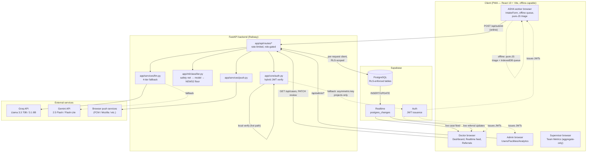
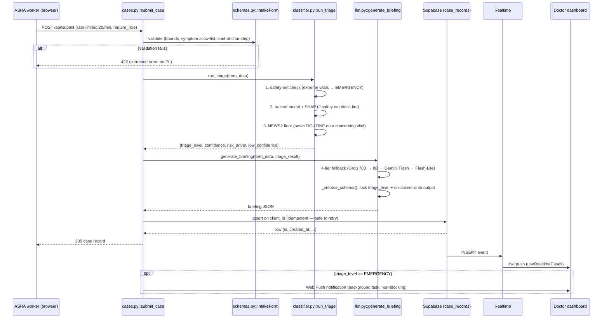
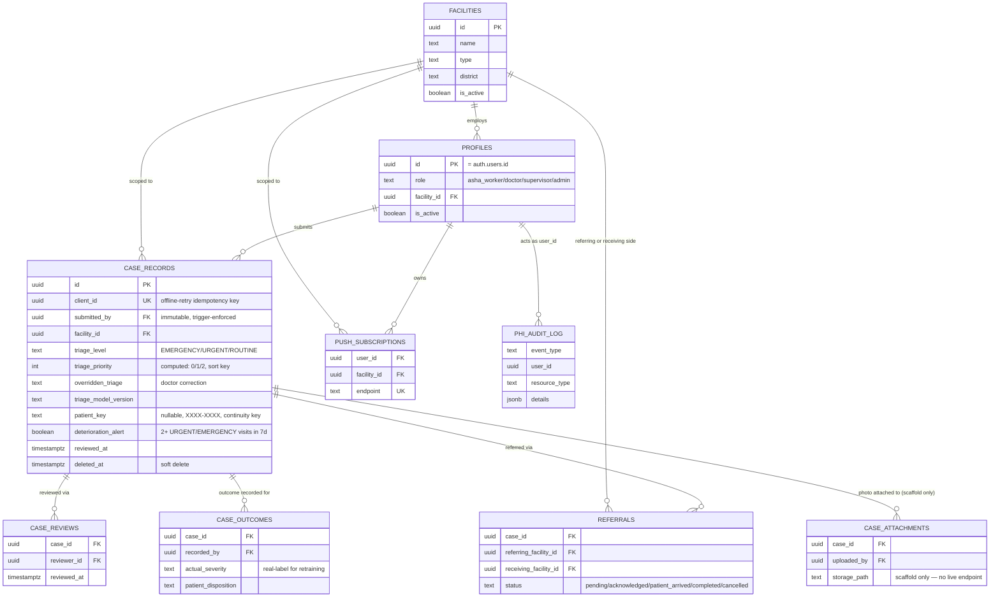
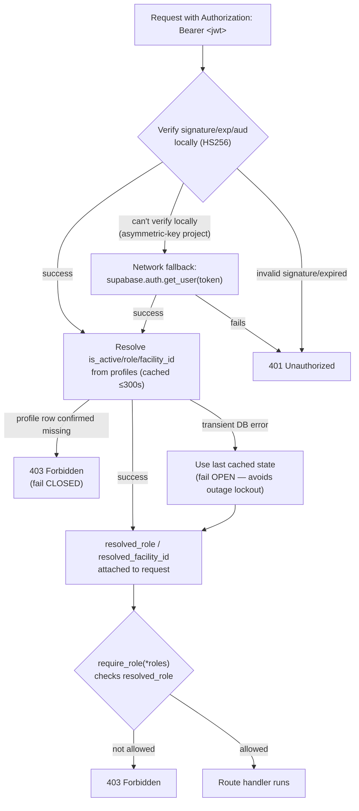

# VitalNet — Codebase Map

**Purpose of this document**: a single, current, high-signal reference so a
future contributor (human or AI agent) can orient in VitalNet without
re-reading the entire codebase. If you make a structural change (new
directory, new major module, a file moves, a data flow changes), **update
this document in the same commit**. Stale maps are worse than no map —
see the "Keeping this document current" section at the bottom for the
specific rule.

Last verified against the codebase: 2026-07-11 (post Round 6 rebuild
Phases 0-6 — the pnpm-workspace TypeScript migration: `packages/
clinical-core` as the single source of clinical truth, a new Supabase Edge
Function backend (`apps/api`, not yet live), a unified offline outbox, and
DB-discipline `SECURITY DEFINER` functions; see `docs/DECISIONS.md` §33 and
git log for the full change list). Earlier verification note (2026-07-04,
post round-3 reconciliation of an independently-developed `dev` branch's
security/reliability work on top of round-2's hybrid auth, pure-JS offline
engine, and ML safety layers) still applies to everything in `backend/`,
which this migration has not touched.

---

## 1. What VitalNet is, in one paragraph

An offline-first clinical triage PWA for rural Indian healthcare. ASHA
(community health) workers fill out a patient intake form — works with or
without connectivity, and requires explicit patient-consent capture before
submission. A local ML classifier (same model, running either in Python
server-side or as a pure-JS tree evaluator in the browser — no
onnxruntime-web, see Option 6 in the ML README) instantly assigns EMERGENCY /
URGENT / ROUTINE, backed by a deterministic safety net that can never be
overridden. An LLM (Groq, with Gemini fallback) generates a structured
clinical briefing for the case. Doctors see a real-time, priority-sorted
dashboard of incoming cases, see low-confidence/review-requested flags, and
mark cases reviewed (soft-deletable, audit-logged). Admins manage users and
facilities. A fourth role, supervisor, gets a facility-scoped, aggregate-only,
non-PHI view of per-ASHA-worker performance for supportive supervision
(`docs/DECISIONS.md` §25) — modeled on NHM's real ASHA Facilitator role, a
parallel workforce-quality line distinct from `doctor`'s clinical authority.
Four roles total (asha_worker, doctor, supervisor, admin), enforced by both
backend checks (role/facility_id resolved fresh from the `profiles` table
every request — never trusted from JWT claims) and Supabase Row Level
Security.

### System architecture



## 2. Repository layout

**Mid-migration** (Round 6 rebuild, `docs/DECISIONS.md` §33 — a pnpm
workspace monorepo replacing the old flat `backend/`+`frontend/` layout).
`backend/` is unchanged in place and still serves 100% of production
traffic; everything else below it is new and not yet live.

```
VitalNet/
├── pnpm-workspace.yaml  Declares apps/* and packages/* as the pnpm workspace.
│                       backend/ and tools/training/ (Python) are NOT part of it.
├── packages/
│   └── clinical-core/  THE single source of clinical truth (TypeScript) — see §3a.
│                       Consumed by both apps/web (browser) and apps/api (server).
├── apps/
│   ├── web/             React 19 + Vite PWA — see §4. Was `frontend/` pre-migration.
│   └── api/              NEW backend: one Supabase Edge Function (Deno + Hono),
│                       running clinical-core in rules-first mode — see §3b.
│                       NOT YET LIVE (no production traffic; apps/web's
│                       ENDPOINT_BACKEND map resolves every endpoint to 'legacy').
├── backend/            LIVE (legacy) FastAPI Python app — see §3. Migrations live in
│                       backend/supabase/migrations/ (version-controlled,
│                       idempotent SQL — the canonical schema source; see §5),
│                       shared by both backends. Deployable until apps/api cuts over.
├── tools/training/     Python ML training pipeline (was backend/scripts/). Generates
│                       synthetic patients and pipes them through packages/clinical-core
│                       (a JSONL subprocess, cli.mjs) for labels + features — Python
│                       only does sklearn training + ONNX→tree-JSON export now.
├── docs/
│   ├── DISASTER_RECOVERY.md   Ops runbook: RTO/RPO targets, restore procedures
│   ├── INCIDENT_RESPONSE.md   Security incident runbook: severity classification,
│   │                     detection → containment → eradication → post-incident
│   │                     review, DPDP breach-notification hook (distinct from
│   │                     DISASTER_RECOVERY.md — adversary-involved vs. not)
│   ├── CLINICAL_GOVERNANCE.md Regulatory posture (CDSCO SaMD), model lifecycle
│   │                     governance, five-layer guardrail architecture
│   ├── CLINICAL_REVIEW.md     Sign-off checklist for packages/clinical-core/
│   │                     src/rules/** changes (Round 6 Phase 7); the
│   │                     outstanding gate on the rules-first cutover.
│   │                     .github/CODEOWNERS requires review on that path.
│   ├── COMPLIANCE_DPDP.md     India DPDP Act 2023 mapping — data-principal
│   │                     rights, fiduciary obligations, honest gap list
│   ├── ACCESSIBILITY.md       WCAG 2.1 AA audit — label association, live
│   │                     regions, color-contrast fixes, honest known gaps
│   ├── SLO.md                 Service level objectives, SLIs, GET /api/metrics
│   │                     (Prometheus), example PromQL/scrape config
│   ├── security-audits/       Historical red-team audit trail (dated folders).
│   │                     Read-only historical record — do not treat findings as
│   │                     current state without cross-checking the code.
│   └── {ARCHITECTURE_RESTRUCTURE,REBUILD_INSTRUCTIONS,IMPROVEMENTS}.md
│                         Historical execution logs from past hardening phases — all
│                         marked [!NOTE] superseded-by-this-file at the top. Useful
│                         for "why is it built this way" archaeology, not "what does
│                         it do today." (Relocated here from repo root to declutter it —
│                         still linked from AGENTS.md/FEATURES_ROADMAP.md where cited.)
├── colab/              Legacy Google Colab training script — historical reference only,
│                       NOT wired into the app, trains on only 14 raw features (predates
│                       ClinicalFeatureEngineer). Do not use its output as a production model.
├── Context/            Only test_credentials.md remains (linked from AGENTS.md/
│                       README.md for E2E test account setup). The rest of this
│                       directory's historical phase-by-phase planning documents was
│                       removed as fully superseded by this file / FEATURES_ROADMAP.md —
│                       recoverable from git history if ever needed.
├── .github/
│   ├── workflows/
│   │   ├── ci.yml               Lint (PR) + pytest/build (push) on main and dev for
│   │   │                        backend/ + apps/web, plus an SBOM job (push-only,
│   │   │                        CycloneDX for backend+frontend deps — docs/SECURITY.md)
│   │   ├── api-edge-function.yml Deno fmt/lint/check/test for apps/api on every PR/push
│   │   │                        touching it or packages/clinical-core; a manual-only
│   │   │                        (workflow_dispatch) `deploy` job — see §3b.
│   │   ├── training-smoke.yml    Fast smoke test (not a real training run) for
│   │   │                        tools/training/'s clinical-core cli.mjs wiring.
│   │   ├── db-schema-drift.yml   PR migration-replay lint + weekly live-fingerprint
│   │   │                        check — see §5.
│   │   ├── backend-keepalive.yml Pings the live legacy backend to avoid free-tier
│   │   │                        cold starts. NOT deleted — backend/ is still live.
│   │   └── supabase-keepalive.yml Pings Supabase to avoid the 7-day pause.
│   ├── dependabot.yml    Daily pip/npm/actions update PRs, targeting dev
│   └── CODEOWNERS        Requires review on packages/clinical-core/src/rules/**
│                       and the legacy backend's ML equivalents — see
│                       docs/CLINICAL_REVIEW.md
├── README.md           Setup, features, deployment — start here
├── AGENTS.md           Conventions for coding agents working in this repo
├── CODEBASE_MAP.md     This file
└── FEATURES_ROADMAP.md Proposed feature backlog with implementation-ready specs
```

## 3. Backend (`backend/`) — legacy, live

FastAPI, Python 3.13 (target; 3.11+ works for local dev), Supabase
(PostgreSQL + Auth + Realtime) as the only database, Groq/Gemini for LLM
briefings, scikit-learn for ML triage.

```
backend/
├── app/
│   ├── main.py                     Entry point ONLY: logging setup, DB schema-
│   │                                compatibility gate + lifespan (loads the ML
│   │                                classifier, degraded/rules-only boot on failure),
│   │                                middleware stack (rate limiter, GZip, CSRF +
│   │                                X-Device-Id guard, security headers, correlation
│   │                                ID, CORS), router registration, global exception
│   │                                handlers (PII-scrubbed validation errors),
│   │                                role-gated /api/health. No route logic lives here.
│   ├── core/
│   │   ├── config.py                Pydantic Settings — all env vars, fails fast at
│   │   │                            import if required vars are missing. Includes:
│   │   │                            jwt_local_verification, revocation_recheck_seconds,
│   │   │                            rate_limit_storage_uri, environment (gates HSTS/
│   │   │                            dev CORS origins/whether .env.local loads at all),
│   │   │                            api_docs_enabled, csrf_token, cors_allowed_origins.
│   │   ├── auth.py                  HYBRID JWT verification: verifies signature/
│   │   │                            exp/aud LOCALLY (HS256 via jwt_secret) on the
│   │   │                            hot path — no Supabase round-trip per request —
│   │   │                            with a network get_user() fallback for
│   │   │                            asymmetric-key projects. Every request resolves
│   │   │                            is_active/role/facility_id fresh from `profiles`
│   │   │                            (one combined query, short-TTL cached per user) —
│   │   │                            NEVER trusts JWT user_metadata for these, since
│   │   │                            it's client-settable and can go stale. Fails
│   │   │                            CLOSED on a confirmed-missing profile, OPEN only
│   │   │                            on a transient DB error. get_current_user() sets
│   │   │                            resolved_role/resolved_facility_id on the returned
│   │   │                            dict; require_role(*roles) reads resolved_role.
│   │   │                            Also exposes verify_sub_for_rate_limit().
│   │   ├── database.py              Three Supabase clients: supabase_anon (public
│   │   │                            reads), get_supabase_for_user() (RLS-scoped, a
│   │   │                            FRESH client per request — deliberate: a shared
│   │   │                            client with a mutated per-request auth token
│   │   │                            would race across concurrent requests and leak
│   │   │                            one user's data to another), supabase_admin
│   │   │                            (service_role, auth.admin.* AND admin-only
│   │   │                            cross-tenant ops — require_role('admin') is the
│   │   │                            only access boundary for admin_routes.py/
│   │   │                            dsr_routes.py/metrics_routes.py, no RLS
│   │   │                            backstop; a small, DECISIONS.md-documented set
│   │   │                            of non-admin routes also use it for exactly one
│   │   │                            aggregate query each — §20, §22, §25, §26).
│   │   │                            extract_bearer_token() validates header format
│   │   │                            before any signature check. validate_schema_
│   │   │                            compatibility() is the startup gate.
│   │   ├── scoping.py                resolve_facility_scope(role, own_facility_id,
│   │   │                            requested_facility_id) — shared by
│   │   │                            supervisor_routes.py and outbreak_routes.py:
│   │   │                            'admin' is global (system-wide, or narrows via
│   │   │                            a query param), every other role is pinned to
│   │   │                            their own facility_id and cannot widen it.
│   │   ├── audit.py                  PHI access audit logging (log_phi_access,
│   │   │                            AuditEventType, get_client_ip) — writes to
│   │   │                            BOTH the dedicated 'vitalnet.audit' logger
│   │   │                            AND the phi_audit_log Postgres table
│   │   │                            (best-effort, non-blocking insert via
│   │   │                            supabase_admin) — viewable via GET
│   │   │                            /api/admin/audit-log / AdminAuditLog.jsx.
│   │   ├── correlation.py            Single contextvar for X-Request-ID, shared by
│   │   │                            the logging formatter and route handlers.
│   │   ├── logging.py                JSON structured logging setup (setup_logging()),
│   │   │                            includes correlation_id via CorrelationIdFilter.
│   │   └── metrics.py                Prometheus counters/histogram (docs/SLO.md):
│   │                                 request count/latency by method+route+status,
│   │                                 triage classifications by level. record_request()
│   │                                 called from main.py's MetricsMiddleware, keyed on
│   │                                 the matched ROUTE TEMPLATE (never the raw path —
│   │                                 unbounded-cardinality footgun).
│   ├── api/routes/
│   │   ├── cases.py                  /api/submit, /api/cases, /api/cases/{id}/review,
│   │   │                             /api/cases/mine, /api/cases/by-patient-key/{key},
│   │   │                             /api/cases/{id}. Owns the shared slowapi `limiter`
│   │   │                             instance (imported by the other route modules)
│   │   │                             keyed on the verified JWT sub. Cursor pagination
│   │   │                             has an id tie-breaker for stability across equal
│   │   │                             timestamps. Row-level authorization via
│   │   │                             _authorize_case_row_access() (admin global, doctor
│   │   │                             facility-scoped, asha_worker own-submissions-only
│   │   │                             — also used by security.py). The by-patient-key
│   │   │                             lookup reuses the same RLS-scoped visibility per
│   │   │                             role (docs/DECISIONS.md §21). submit_case() also
│   │   │                             runs _check_deterioration_pattern() — one narrow
│   │   │                             supabase_admin count-only query (same exception
│   │   │                             class as §20) forcing needs_review when a
│   │   │                             patient_key has 2+ URGENT/EMERGENCY visits in the
│   │   │                             trailing 7 days (docs/DECISIONS.md §22). Every
│   │   │                             create/read/update is PHI-audit-logged.
│   │   ├── admin_routes.py           /api/admin/* — user CRUD (password complexity
│   │   │                             policy, orphan rollback on profile-provisioning
│   │   │                             failure, profile/auth-metadata rollback on
│   │   │                             partial failure), facility CRUD (optimistic-
│   │   │                             concurrency toggle), system stats, audit-log
│   │   │                             view, and POST /api/admin/users/bulk (CSV
│   │   │                             onboarding — reuses _provision_user() per row,
│   │   │                             one bad row doesn't fail the batch). All
│   │   │                             admin-only (require_role('admin')), all
│   │   │                             rate-limited and PHI-audit-logged.
│   │   ├── analytics_routes.py       /api/analytics/* — aggregate stats, EMERGENCY
│   │   │                             rate trend, response-time SLA (median/p90/
│   │   │                             overdue per tier), ML/doctor agreement rate,
│   │   │                             and a case CSV export (streamed, PHI-audit-
│   │   │                             logged as bulk egress). Facility-scoped for
│   │   │                             'doctor', global for 'admin' (GLOBAL_SCOPE_ROLE
│   │   │                             constant). Queries run concurrently
│   │   │                             (asyncio.gather over asyncio.to_thread) with a
│   │   │                             per-query timeout and graceful degradation
│   │   │                             (_degraded flag) instead of failing the whole
│   │   │                             dashboard on one slow query.
│   │   ├── security.py               DELETE /api/security/cases/{id} — soft-delete
│   │   │                             (sets deleted_at, requires X-Device-Id), reuses
│   │   │                             cases.py's row-level authz helper. PHI-audit-logged.
│   │   ├── push_routes.py            Web Push subscribe/unsubscribe, GET
│   │   │                             /api/facilities (doctor-accessible target
│   │   │                             picker), and the unreviewed-EMERGENCY re-alert
│   │   │                             endpoint (POST /api/push/check-emergency-
│   │   │                             escalations — idempotent, meant to be driven by
│   │   │                             an external scheduler/cron). Send logic lives
│   │   │                             in app/services/push.py to avoid a circular
│   │   │                             import with cases.py.
│   │   ├── referral_routes.py        Inter-facility referral workflow — POST
│   │   │                             /api/cases/{id}/refer, GET /api/referrals,
│   │   │                             PATCH /api/referrals/{id}/status (forward-only
│   │   │                             state machine, receiving-facility-only). Also
│   │   │                             PATCH /api/facilities/{id}/capacity — self-
│   │   │                             reported available/limited/full, own-facility-
│   │   │                             or-admin, via the RLS-scoped client (needed
│   │   │                             facilities' first-ever UPDATE policy — see
│   │   │                             docs/DECISIONS.md §19). GET /api/facilities
│   │   │                             attaches open_case_count per facility (one
│   │   │                             deliberate, narrow supabase_admin aggregate-
│   │   │                             only query — docs/DECISIONS.md §20) and sorts
│   │   │                             least-loaded first as a referral suggestion.
│   │   ├── dsr_routes.py             DPDP data-subject-request lifecycle
│   │   │                             (docs/COMPLIANCE_DPDP.md), admin-only, scoped
│   │   │                             to a single case_id: GET .../export (right to
│   │   │                             access), POST .../erase (right to erasure —
│   │   │                             redacts identifying fields, never touches the
│   │   │                             immutable case_outcomes table), POST
│   │   │                             .../purge-expired (retention sweep, external-
│   │   │                             scheduler-driven like the re-alert endpoint).
│   │   ├── voice_routes.py           POST /api/voice/transcribe — server-side voice
│   │   │                             transcription (app/services/voice.py), Groq
│   │   │                             Whisper tried first then Sarvam AI as fallback
│   │   │                             (docs/DECISIONS.md §24). Online-only, no audio
│   │   │                             persisted; the browser-STT path is the fallback,
│   │   │                             not this (docs/DECISIONS.md §15).
│   │   ├── metrics_routes.py         GET /api/metrics — Prometheus text format
│   │   │                             (app/core/metrics.py), admin-only. Backs the
│   │   │                             SLIs in docs/SLO.md.
│   │   ├── supervisor_routes.py      GET /api/supervisor/team-metrics —
│   │   │                             per-ASHA-worker aggregate metrics (submission
│   │   │                             count, needs_review/contraindication/
│   │   │                             deterioration rates, tier distribution) for
│   │   │                             require_role('supervisor', 'admin'). One narrow
│   │   │                             supabase_admin aggregate query, same exception
│   │   │                             class as §20/§22 — no case row or patient field
│   │   │                             crosses the RLS boundary. supervisor is scoped
│   │   │                             to their own facility_id only; admin defaults
│   │   │                             system-wide or narrows via ?facility_id
│   │   │                             (docs/DECISIONS.md §25).
│   │   ├── outbreak_routes.py        GET /api/outbreak/signals — EARS C1
│   │   │                             aberration detection (7-day trailing baseline
│   │   │                             mean + 3*stddev, floor of 3 cases) over
│   │   │                             (facility, symptom, day) aggregate counts, for
│   │   │                             require_role('doctor', 'supervisor', 'admin').
│   │   │                             Informational only, not a validated
│   │   │                             surveillance system (docs/DECISIONS.md §26).
│   │   │                             Same supabase_admin aggregate-only exception
│   │   │                             as supervisor_routes.py; facility scoping
│   │   │                             shared via app/core/scoping.py.
│   │   └── protocol_routes.py        POST /api/protocol/ask, GET .../questions,
│   │                                 PATCH .../questions/{id}/curate — grounded
│   │                                 guideline lookup assistant informed by
│   │                                 ASHABot's published design (docs/DECISIONS.md
│   │                                 §27). Carries NO PHI (unlike case_records), so
│   │                                 this uses REAL Postgres RLS via
│   │                                 get_supabase_for_user, not the supabase_admin
│   │                                 exception — SELECT is facility-wide for every
│   │                                 role by design (shared FAQ), UPDATE
│   │                                 (curation) is doctor/supervisor/admin only.
│   │                                 The LLM call (generate_protocol_answer in
│   │                                 app/services/llm.py) is a fully separate call
│   │                                 path from generate_briefing — never shares
│   │                                 the triage system prompt or takes patient
│   │                                 vitals as input.
│   ├── models/schemas.py            Pydantic request/response models. IntakeForm is
│   │                                 the case-submission contract — every field is
│   │                                 bounded (min/max length, numeric ranges, enums),
│   │                                 free-text fields are control-character-stripped,
│   │                                 symptoms are allow-listed, and consent_captured
│   │                                 must be true (server-enforced, not just UI).
│   │                                 human_review_requested/reason let an ASHA worker
│   │                                 flag a case for review independent of ML tier.
│   │                                 patient_key (optional, XXXX-XXXX, PATIENT_KEY_RE)
│   │                                 is the patient continuity key — see
│   │                                 docs/DECISIONS.md §21. This schema only governs
│   │                                 the legacy backend's own validation now — it is
│   │                                 not mirrored anywhere; apps/web/apps/api validate
│   │                                 against packages/clinical-core/src/schema.ts
│   │                                 instead (a separate, independently-maintained
│   │                                 schema — see §3a). If you add a field relevant to
│   │                                 triage/features, add it there too.
│   ├── ml/
│   │   ├── README.md                 ML architecture + clinical grounding — READ
│   │   │                             before touching classifier.py / clinical_features.py.
│   │   ├── MODEL_CARD.md              Intended use, metrics (and what they do/don't
│   │   │                             mean), limitations, ethics — the honest record.
│   │   ├── classifier.py             Public ML API: load_classifier(), predict_triage()
│   │   │                             / run_triage(), get_classifier_info(). Three
│   │   │                             layers per prediction: (1) _safety_net_check →
│   │   │                             EMERGENCY for extreme vitals/critical symptoms
│   │   │                             (incl. severe hypertension in pregnancy when
│   │   │                             is_pregnant is set — docs/DECISIONS.md §30),
│   │   │                             (2) the trained model, (3) _news2_concerning_vital
│   │   │                             floor → never ROUTINE on a concerning vital. Also
│   │   │                             attaches contraindication_flags (below) and emits
│   │   │                             a low_confidence abstention flag.
│   │   ├── contraindications.py      check_contraindications() — free-text keyword-
│   │   │                             matched flags (NSAID+renal, ACE-inhibitor+renal,
│   │   │                             metformin+vomiting, anticoagulant+bleeding, beta-
│   │   │                             blocker+bradycardia, insulin+altered-consciousness).
│   │   │                             Advisory, not a drug-interaction database — see
│   │   │                             docs/DECISIONS.md §17. Never changes triage tier;
│   │   │                             cases.py folds any flag into needs_review. This is
│   │   │                             the legacy backend's own copy — no longer mirrored
│   │   │                             anywhere; packages/clinical-core/src/
│   │   │                             contraindications.ts is the independent,
│   │   │                             authoritative version apps/web/apps/api use.
│   │   ├── clinical_features.py     ClinicalFeatureEngineer — expands ~14 raw intake
│   │   │                             fields into 43 engineered features. Legacy-backend-
│   │   │                             only now — not mirrored anywhere (see §3a's
│   │   │                             features.ts, the independent authoritative
│   │   │                             version). tools/training/train_classifier.py
│   │   │                             doesn't call this either any more.
│   │   └── models/triage_classifier.pkl
│   │                                 The trained model + SHAP explainer bundle.
│   │                                 Regenerate via tools/training/train_classifier.py — never
│   │                                 hand-edit.
│   ├── services/
│   │   ├── llm.py                    4-tier LLM fallback (Groq 70B → Groq 8B → Gemini
│   │   │                             Flash → Gemini Flash-Lite) for clinical briefings.
│   │   │                             triage_level and disclaimer are hard-locked onto
│   │   │                             every LLM output regardless of tier
│   │   │                             (_enforce_schema()) — no LLM call can change the
│   │   │                             triage decision. Free-text patient fields are
│   │   │                             sanitised before entering the prompt
│   │   │                             (_sanitize_field()) to resist prompt injection.
│   │   │                             Also owns generate_patient_summary() — a separate,
│   │   │                             on-demand, single-tier call that only restates the
│   │   │                             already-fixed triage/briefing in plain language for
│   │   │                             the patient (docs/DECISIONS.md §18), never a fresh
│   │   │                             clinical read; falls back to a canned per-tier
│   │   │                             sentence on any failure. Also owns
│   │   │                             generate_protocol_answer() — a fully separate
│   │   │                             call path for protocol_routes.py (docs/DECISIONS.md
│   │   │                             §27): its own Groq→Gemini tiered fallback, its own
│   │   │                             system prompt built from protocol_knowledge.md
│   │   │                             (context-stuffed reference material, no vector DB),
│   │   │                             shares NO code with generate_briefing by design —
│   │   │                             never takes patient vitals as input. Returns
│   │   │                             {answer, grounded, generated}; grounded=false means
│   │   │                             the question needs human curation.
│   │   ├── protocol_knowledge.md     Curated reference doc stuffed into
│   │   │                             generate_protocol_answer()'s system prompt: ANC
│   │   │                             visit schedule, UIP immunisation schedule, IMNCI
│   │   │                             newborn/pregnancy danger signs, referral criteria.
│   │   │                             The ONLY source of truth for the protocol
│   │   │                             assistant — it refuses/escalates rather than using
│   │   │                             outside model knowledge.
│   │   ├── push.py                   Web Push send logic (push_emergency_alert,
│   │   │                             _send_one) — separate module from push_routes.py
│   │   │                             specifically to avoid a circular import with
│   │   │                             cases.py. No-ops silently if VAPID keys aren't
│   │   │                             configured. Deletes a subscription on a 410-Gone
│   │   │                             send response (stale subscription cleanup).
│   │   ├── sms.py                    SMS fallback SCAFFOLDING ONLY (FEATURES_ROADMAP
│   │   │                             §3.1) — SmsGateway protocol, NullSmsGateway
│   │   │                             (logs instead of sending), parse_inbound_sms()
│   │   │                             strict-format parser. No live webhook endpoint —
│   │   │                             see docs/DECISIONS.md §11.
│   │   └── voice.py                  transcribe() behind voice_routes.py — two
│   │                                 independent providers, Groq Whisper
│   │                                 (whisper-large-v3-turbo) tried first for every
│   │                                 language, Sarvam AI (saaras:v3) as the fallback
│   │                                 only if Groq is unconfigured or fails (Sarvam's
│   │                                 free tier is a fixed signup credit — conserved
│   │                                 rather than spent on requests Groq already
│   │                                 handles; docs/DECISIONS.md §24). Either
│   │                                 GROQ_API_KEY or SARVAM_API_KEY alone is enough
│   │                                 for every supported language. i18n language codes
│   │                                 map directly onto Whisper's ISO-639-1 codes /
│   │                                 Sarvam's BCP-47 codes. Audio is transcribed and
│   │                                 discarded, never persisted (docs/DECISIONS.md §15).
│   └── __init__.py files (package markers, no logic)
├── scripts/
│   ├── train_classifier.py          THE training entrypoint (single unified model —
│   │                                 see app/ml/README.md). One run outputs the
│   │                                 backend .pkl, frontend triage_trees.json +
│   │                                 features_config.json, and the golden-vector
│   │                                 fixture; asserts pkl==onnx==tree-JSON parity;
│   │                                 reports 5-fold CV + calibration (ECE).
│   ├── tree_export.py                Converts the (in-memory) ONNX tree ensemble to
│   │                                 the compact triage_trees.json + a Python
│   │                                 reference evaluator used for the parity assert.
│   ├── export_golden_vectors.py      Generates tests/fixtures/golden_feature_vectors.json
│   │                                 (240 synthetic patients, fixed seed) — the ground
│   │                                 truth for test_feature_parity.py AND
│   │                                 featureParity.test.mjs. Freezes datetime.now() to a
│   │                                 fixed reference (see docs/DECISIONS.md §12) so the
│   │                                 two time-dependent engineered features don't make
│   │                                 the fixture flaky.
│   ├── retrain_from_outcomes.py      Retraining pipeline reading real case_outcomes +
│   │                                 overridden_triage labels (FEATURES_ROADMAP §1.3),
│   │                                 blended with a shrinking proportion of synthetic
│   │                                 data. Reports an agreement-rate delta vs. the
│   │                                 production model. NEVER touches the production
│   │                                 .pkl or auto-deploys — saves a candidate file only;
│   │                                 promotion is a manual, human-gated step.
│   ├── fairness_audit.py             Subgroup (age band × sex) accuracy/EMERGENCY-recall
│   │                                 report on a fresh synthetic eval set, run through
│   │                                 the FULL pipeline (safety net + model + NEWS2
│   │                                 floor). Operator-run, not scheduled/CI — see
│   │                                 app/ml/README.md.
│   ├── drift_monitor.py              Population Stability Index per engineered feature,
│   │                                 live case_records vs. the synthetic training
│   │                                 distribution. Needs a real Supabase project.
│   │                                 Operator-run, not scheduled/CI.
│   └── load_test.py                  asyncio+httpx load generator (no new dependency —
│                                     httpx is already required). Refuses to target
│                                     anything but localhost without
│                                     --confirm-non-local — see docs/INCIDENT_RESPONSE.md.
│                                     Operator-run, not CI.
├── prompts/clinical_system_prompt.txt
│                                     System prompt for the LLM briefing generator.
├── tests/
│   ├── conftest.py                   Sets fallback fake (JWT-format) Supabase creds so
│   │                                 unit tests run offline; real CI secrets win.
│   ├── test_direct.py                Classifier smoke tests, no server/DB required.
│   ├── test_classifier_safety.py     Property tests for the safety guarantees (extreme
│   │                                 vitals → EMERGENCY; concerning vital never ROUTINE;
│   │                                 low_confidence present). Run in CI.
│   ├── test_contraindications.py     Unit tests for check_contraindications() — one
│   │                                 positive/negative case per rule, plus predict_
│   │                                 triage() integration (flags present on both the
│   │                                 safety-net and model-decision exit paths).
│   ├── test_patient_summary.py       Unit tests for generate_patient_summary() — no-
│   │                                 client/call-failure/empty-response fallback paths,
│   │                                 and that a successful call passes the target
│   │                                 language through to the prompt.
│   ├── test_patient_key.py           Schema-level tests for IntakeForm.patient_key —
│   │                                 format acceptance/rejection, uppercase
│   │                                 normalization, and that the excluded-ambiguous-
│   │                                 char alphabet matches the frontend generator.
│   ├── test_deterioration_alert.py   Unit tests for _check_deterioration_pattern() —
│   │                                 no-key skip, count thresholds (0/1/2 prior
│   │                                 qualifying visits combined with today's tier),
│   │                                 and the supabase_admin query filters, mocked.
│   ├── test_admin_authz.py           Asserts every /api/admin route — across
│   │                                 admin_routes.py AND dsr_routes.py (see
│   │                                 ADMIN_ROUTE_MODULES) — is require_role('admin')-
│   │                                 guarded (the only boundary on the RLS-bypassing
│   │                                 service-role client). Run in CI.
│   ├── test_feature_parity.py        A Python-internal regression guard now (not a
│   │                                 cross-language parity check any more, see this
│   │                                 file's own header) — replays
│   │                                 backend/tests/fixtures/golden_feature_vectors.json
│   │                                 through ClinicalFeatureEngineer and asserts no
│   │                                 drift. Exists only as long as backend/app/ does.
│   │                                 Freezes the clock (docs/DECISIONS.md §23). Run in CI.
│   ├── test_bulk_user_import.py      Row-isolation and orphaned-auth-user-rollback
│   │                                 tests for admin_routes.py's _provision_user() —
│   │                                 one bad CSV row must not fail the whole batch.
│   ├── test_sms_parser.py            Unit tests for the SMS scaffolding's fixed-format
│   │                                 parser (app/services/sms.py) — pure logic, no
│   │                                 DB/network mocking needed.
│   ├── test_dsr_routes.py            Unit tests for dsr_routes.py's plain helper
│   │                                 functions — redaction field coverage, deleted_at
│   │                                 idempotency, and that case_outcomes is never
│   │                                 written (immutable-by-design invariant).
│   ├── test_voice_transcription.py   Unit tests for app/services/voice.py — not-
│   │                                 configured error, language-code pass-through/
│   │                                 fallback-to-None, Groq-tried-first ordering,
│   │                                 Sarvam-as-fallback on Groq failure, Sarvam
│   │                                 never attempted when unconfigured, both-fail
│   │                                 wrapping. Uses asyncio.run() directly (no
│   │                                 pytest-asyncio dep).
│   ├── test_scoping.py                Tests resolve_facility_scope() (app/core/
│   │                                 scoping.py) — the shared admin-global/role-
│   │                                 owns-facility rule used by supervisor_routes.py
│   │                                 and outbreak_routes.py.
│   ├── test_supervisor_routes.py     Tests _aggregate_team_metrics() — per-worker
│   │                                 grouping, rate computation, sort order, rows
│   │                                 with no submitted_by skipped.
│   ├── test_outbreak_routes.py       Tests _compute_ears_signals() — floor
│   │                                 enforcement, stable-baseline non-flagging, sharp-
│   │                                 spike flagging, noisy-baseline false-positive
│   │                                 avoidance, zero-baseline-with-floor-met flagging,
│   │                                 per-facility/per-symptom independence.
│   ├── test_protocol_answer.py       Tests generate_protocol_answer() — grounded vs.
│   │                                 ungrounded contract, Groq->Gemini fallback, the
│   │                                 canned fallback when no LLM tier is configured,
│   │                                 question-text sanitization before it reaches the
│   │                                 prompt.
│   └── test_e2e.py                   Full integration test against a running server +
│                                     real Supabase auth (needs seeded test users).
│                                     NOT run in unit CI (needs a live server).
├── seed_user.py                      One-off script to create/fix a test doctor
│                                     account. Mutates your Supabase project directly.
├── requirements.txt                  Runtime dependencies. scikit-learn and shap are
│                                     pinned to EXACT versions — see the comments in
│                                     the file and app/ml/README.md for why.
├── requirements-train.txt            ONLY needed to run tools/training/train_classifier.py
│                                     (skl2onnx, onnxruntime) — NOT installed in
│                                     production; keeps the deploy footprint small.
├── Procfile / railway.toml / runtime.txt
│                                     Railway deployment config.
└── CLASSIFIER_CHANGELOG.md           ML model version history.
```

### Backend request lifecycle (submit case, the core flow)



1. `POST /api/submit` (`cases.py::submit_case`) — rate-limited 20/min/user,
   `require_role('asha_worker', 'admin')`.
2. `IntakeForm` Pydantic validation (bounds, symptom allow-list, control-char
   stripping).
3. `run_triage(form_data)` (`classifier.py`) — safety-net check first, then
   the trained model + SHAP explanation if the safety net didn't trigger.
4. `generate_briefing(form_data, triage_result)` (`llm.py`) — 4-tier LLM
   fallback; triage_level is locked onto the output regardless of which
   tier (or none) succeeded.
5. Upserted into `case_records` via a user-scoped Supabase client
   (`get_supabase_for_user`) using `client_id` as the idempotency key
   (`on_conflict="client_id", ignore_duplicates=True"`) — this is what makes
   offline-queue retries safe.
6. Supabase Realtime pushes the INSERT to any subscribed doctor dashboards
   (`useRealtimeCases` on the frontend).

## 3a. clinical-core (`packages/clinical-core/`) — the single source of clinical truth

TypeScript, built with `tsup` to an ESM `dist/` (gitignored — every consumer
needs `pnpm --filter @vitalnet/clinical-core build` run first). Replaces
four previously hand-mirrored Python/JS pairs — see `docs/DECISIONS.md`
§33 for the full migration record and conformance evidence.

```
packages/clinical-core/
├── src/
│   ├── schema.ts          Zod IntakeForm — absorbed backend/app/models/schemas.py's
│   │                      bounds/validators (bp_dia<bp_sys, symptom allow-list,
│   │                      patient-key regex) AND frontend's old validation.js. One
│   │                      schema, `export type IntakeForm = z.infer<...>`.
│   ├── rules/
│   │   ├── bands.ts        NEWS2/PALS vital-derangement band tables (adult +
│   │   │                  age-banded HR/BP/temp/SpO2), each row carrying a citation.
│   │   ├── rules.ts        Override rules that ALWAYS win: safety-net extreme-
│   │   │                  presentation escalations (ported from classifier.py's
│   │   │                  _safety_net_check) + the ACOG preeclampsia rule + the
│   │   │                  NEWS2-floor concerning-vital check.
│   │   └── engine.ts        assignTier() — the authoritative tier-assignment engine:
│   │                      1) checkOverrides() first (unconditional EMERGENCY,
│   │                      nothing below runs if one fires), 2) the aggregate
│   │                      NEWS2/qSOFA/PALS scorer (promoted from what was
│   │                      training-label-only code — backend/scripts/
│   │                      train_classifier.py::assign_triage_label pre-migration),
│   │                      3) the NEWS2 floor as a redundant, independently-testable
│   │                      backstop. The ML model plays NO role in this function.
│   ├── features.ts         43-feature engineering — port of
│   │                      ClinicalFeatureEngineer/buildFeatureMap. Feeds ONLY the
│   │                      advisory ML model's input vector; never the tier decision.
│   ├── treeEvaluator.ts    Dependency-free tree-JSON walker (port of the old
│   │                      frontend treeEvaluator.js / tree_export.py's Python
│   │                      reference) + Saabas-style path attribution — REPLACES SHAP
│   │                      at inference (`top_factors`: sum of per-feature score
│   │                      deltas along the decision path). SHAP remains a
│   │                      training-only dependency for artifacts no longer shipped.
│   ├── contraindications.ts Keyword-based contraindication table (moved from the
│   │                      old frontend clinicalRules.js / backend
│   │                      app/ml/contraindications.py).
│   ├── patientKey.ts        generatePatientKey()/normalizePatientKey() (moved from
│   │                      the old frontend patientKey.js).
│   └── triage.ts            Orchestrator: triage(form, trees?) -> {tier, firedRules,
│                          contraindications, model?}. Two modes behind one exported
│                          constant: `hybrid` (safety-net -> model -> NEWS2 floor,
│                          reproduces the legacy backend's semantics exactly — used
│                          by the Phase-1 conformance test AND, deliberately, by
│                          apps/web's offline triage today, since that's what
│                          matches the live, authoritative backend/app/ — see
│                          apps/web/README.md) and `rules_first` (the engine above
│                          is authoritative; model is advisory — the target
│                          end-state, what apps/api runs, not yet cut over).
├── cli.mjs                 JSONL subprocess CLI for tools/training/train_classifier.py:
│                          `label` (assignTier -> 0/1/2) and `engineer-features`
│                          (buildFeatureMap). The ONE point where Python's synthetic-
│                          data generator hands patients to this package instead of
│                          maintaining a second copy of the scoring/feature logic.
└── test/                   vitest: ported safety+fuzz suites, every rule's embedded
                           {input, expect} vectors, golden vectors (tree-eval AND
                           feature-engineering — the latter now generated FROM this
                           package by the training script, a regression snapshot
                           rather than a cross-language check), and a conformance
                           suite (test/conformance/) replaying 10k Python-labelled
                           patients through triage() in hybrid mode.
```

**Advisory ML output**: `{model_tier, model_confidence, low_confidence,
top_factors}` — computed by `triage.ts` alongside (never in place of) the
rules-engine tier. `model_tier !== tier` folds into `needs_review` server-
side (`apps/api`'s `_shared/cases.ts::computeNeedsReview`) — a deliberate,
tested safety property: since the rules engine is never "low confidence"
about its own decision, an EMERGENCY(model)→lower(rules) de-escalation must
never silently sink out of the priority queue unflagged.

## 3b. apps/api (`apps/api/`) — new backend, not yet live

Supabase Edge Function (Deno + Hono), one function (`api`) with a Hono
router inside — the official Supabase pattern (avoids multiplying cold
starts vs. one function per route). Ports the FastAPI backend's full
middleware stack and every route tranche, running clinical-core in
`rules_first` mode. **Has not received production traffic** — see
`apps/api/README.md` for full status and the cutover mechanics.

```
apps/api/supabase/functions/api/
├── index.ts               Hono app entrypoint — middleware wiring + route mounting.
├── deno.json                Import map (hono, jose, @supabase/supabase-js, zod,
│                          web-push, @vitalnet/clinical-core via a relative dist/
│                          import — NOT a published package, and NOT gitignore-safe
│                          without a build step first — see apps/api/README.md's
│                          "Running locally" section).
├── _shared/
│   ├── config.ts            Deno.env settings, mirrors backend/app/core/config.py.
│   ├── database.ts           Supabase client factories (anon/user-scoped/admin).
│   ├── auth.ts                Hybrid JWT verification against Supabase JWKS —
│   │                        ES256 works NATIVELY here (fixes a dead fast-path the
│   │                        Python backend has to work around — DECISIONS §29) —
│   │                        + profile resolution + requireRole().
│   ├── correlationId.ts, securityHeaders.ts, csrfDeviceGuard.ts, rateLimit.ts
│   │                        (fn_rate_limit-backed), audit.ts (log_phi_access),
│   │                        queryTimeout.ts — ports of the FastAPI middleware stack.
│   ├── cases.ts               Case row-authorization (3-way role check),
│   │                        sanitization, risk-driver formatting, computeNeedsReview()
│   │                        (folds model/rules disagreement into needs_review).
│   ├── model.ts               Bundles the trained advisory tree model for triage().
│   ├── llm.ts, prompts.ts, voice.ts  4-tier Groq/Gemini fallback, static prompt
│   │                        text, Groq Whisper -> Sarvam AI transcription fallback.
│   ├── webpush.ts             VAPID web push send via the "web-push" npm package —
│   │                        FLAGGED as the riskiest port (crypto); has a send-to-self
│   │                        integration test but no live-network coverage by design.
│   └── idempotency.ts          Unified-outbox X-Event-Id replay: a repeated event
│                              replays the stored response from client_events instead
│                              of re-running the handler (skips triage + the LLM call
│                              on a retried drain). Layered on top of, not replacing,
│                              case_records.client_id's own DB-level idempotency.
├── routes/                  health, outbreak, supervisor, protocol, referral, metrics,
│                          analytics, cases (submit/review/override/outcome/list/
│                          detail/by-key/patient-summary), security, dsr, admin, push,
│                          voice — full parity with the FastAPI route set.
└── test/                    Hono app.request() in-memory contract tests, incl. the
                           ported admin-authz scan. The JWKS/ES256 auth path and the
                           webpush send both need a live Supabase project to exercise
                           for real — deliberately not covered by these tests (see
                           test/auth.test.ts's and test/idempotency.test.ts's headers).
```

**Cutover mechanics**: `apps/web/src/api/base.js`'s `ENDPOINT_BACKEND` map
resolves each endpoint to `'legacy'` (backend/) or `'edge'` (apps/api) —
flipping one entry is the entire per-tranche rollback surface. Every entry
is `'legacy'` today. `.github/workflows/api-edge-function.yml`'s `deploy`
job is `workflow_dispatch`-only (never fires on push/PR) so that deploying
is always a deliberate, auditable action, not something that starts serving
traffic as a side effect of merging.

## 4. Frontend (`apps/web/`)

React 19, Vite 7, Tailwind CSS v4, `vite-plugin-pwa` for offline/installable
support, no TypeScript (plain `.jsx`/`.js`). Moved from `frontend/` to
`apps/web/` in the Round 6 pnpm-workspace migration (`docs/DECISIONS.md`
§33) — imports `@vitalnet/clinical-core` (`packages/clinical-core`) as a
`workspace:*` dependency for all clinical logic; nothing below re-implements
rules, feature engineering, tree evaluation, or contraindications.

```
apps/web/src/
├── main.jsx                  Entry point — mounts <App/>, imports i18n.js (must run
│                              before render), registers the PWA service worker.
├── i18n.js                    react-i18next init (FEATURES_ROADMAP §2.1). Persists the
│                              chosen language to localStorage, updates
│                              document.documentElement.lang. See docs/DECISIONS.md §10
│                              for why hi/ta are English placeholders, not real
│                              translations, and locales/README.md for the same.
├── locales/
│   ├── en.json                 Source of truth for every i18n key.
│   ├── hi.json, ta.json         Byte-for-byte copies of en.json pending clinician review.
│   └── README.md                Explains the placeholder status — read before "finishing"
│                              a translation yourself.
├── App.jsx                   Role-based routing (no react-router — just profile.role
│                              branching). Panels are React.lazy()-loaded per role so a
│                              given user only downloads their own panel's code.
├── store/authStore.jsx       AuthProvider/useAuth — Supabase session + profile state.
│                              Profile fetch joins facilities(phone) and caches it to
│                              localStorage (vn_facility_phone) — the one piece of
│                              profile data that must survive an offline reload, for
│                              EmergencySmsAlert.jsx (docs/DECISIONS.md §14).
├── lib/
│   ├── supabase.js            Supabase client — IndexedDB-backed session storage
│   │                          (survives memory pressure better than localStorage on
│   │                          low-RAM Android tablets).
│   ├── api.js                 Backward-compat barrel re-exporting from api/*.js and
│   │                          stores/syncStore.js — prefer importing from the
│   │                          specific module directly in new code.
│   ├── connectivity.js        isServerReachable() — real backend health-check probe,
│   │                          NOT navigator.onLine (which only checks local interface,
│   │                          not actual backend reachability — critical for rural
│   │                          satellite-link scenarios).
│   ├── offlineDB.js            Shared idb opener for the whole app (DB_VERSION 3) —
│   │                          the `outbox` store (below) and the drafts store
│   │                          (useDraftSave.js) both live here. The v2→v3 upgrade
│   │                          migrates old `submission_queue` rows into `outbox` as
│   │                          `type:'case.submit'` events, then drops the old store.
│   ├── outbox.js               THE unified offline outbox (Round 6 Phase 5,
│   │                          docs/DECISIONS.md §33) — replaced the case-submission-
│   │                          specific `offlineQueue.js`. Generic IndexedDB event
│   │                          queue: `{event_id, type, payload, created_at, attempts,
│   │                          status(pending|dead), last_error}`. `event_id` is the
│   │                          SAME uuid as `case_records.client_id` and the
│   │                          `X-Event-Id` header apps/api's idempotency middleware
│   │                          dedupes on. A permanently-failing (4xx) event is
│   │                          dead-lettered, not silently dropped — surfaced by
│   │                          OfflineBanner.jsx with retry/discard actions. Only
│   │                          `type:'case.submit'` exists today, but the store isn't
│   │                          case-specific — a future offline-capable action reuses
│   │                          it without another IndexedDB version bump.
│   └── push.js                 Web Push subscription helper — requests Notification
│                              permission, subscribes via pushManager.subscribe(), POSTs
│                              to /api/push/subscribe. Never throws; the caller (PushPrompt)
│                              treats decline/unsupported as a normal, expected outcome.
├── stores/syncStore.js        submitCase() (online+offline paths, thin client over
│                              lib/outbox.js) and processQueue() (drains the outbox
│                              with a paced delay to stay under the backend rate limit;
│                              a `case.submit` event dispatches through drainCaseSubmit()).
├── api/{auth,cases,admin,analytics,referrals,voice}.js
│                              Stateless fetch wrappers per domain, all via authHeaders().
│                              base.js resolves each endpoint to 'legacy' (backend/,
│                              live) or 'edge' (apps/api, not yet live) via
│                              ENDPOINT_BACKEND — the per-tranche cutover switch;
│                              every entry is currently 'legacy'. voice.js strips
│                              Content-Type from authHeaders() before a multipart
│                              upload so fetch can set its own boundary.
├── hooks/
│   ├── useLocalTriage.js      Wires up offline-model warmup (triggered on offline/
│   │                          unreachable events) and classify() — calls
│   │                          @vitalnet/clinical-core's triage() in "hybrid" mode
│   │                          (matches the live backend/app/'s model-primary
│   │                          semantics — NOT "rules_first", deliberately; see
│   │                          triageClassifier.js below and apps/web/README.md).
│   ├── useDraftSave.js        Auto-saves IntakeForm state to IndexedDB keyed by
│   │                          client_id (survives tab eviction on low-RAM devices).
│   ├── useRealtimeCases.js    Supabase Realtime subscription wrapper (INSERT/UPDATE),
│   │                          used by Dashboard, ASHAPanel history, AnalyticsDashboard.
│   ├── useRealtimeReferrals.js Same pattern, but binds TWO postgres_changes filters
│   │                          (referring_facility_id / receiving_facility_id) since a
│   │                          facility can be on either side of a referral.
│   └── useVoiceInput.js       Voice-to-text — tries server-side transcription
│                              (MediaRecorder + POST /api/voice/transcribe, the
│                              accuracy layer for Indic medical speech) first, falls
│                              back to the browser's own SpeechRecognition only if
│                              MediaRecorder/mic access is unavailable or the server
│                              call fails. BOTH paths need connectivity — the browser
│                              engine also calls a network speech API — so availability
│                              is still gated on navigator.onLine either way
│                              (docs/DECISIONS.md §15).
├── utils/
│   ├── triageClassifier.js    Offline MODEL-LOADING ONLY now (Round 6 Phase 5) — fetches
│   │                          + caches /models/triage_trees.json and
│   │                          features_config.json, then calls @vitalnet/clinical-core's
│   │                          triage() in "hybrid" mode (matches the live backend's
│   │                          model-primary semantics, not the not-yet-cut-over
│   │                          "rules_first" — see this file's own header comment
│   │                          and apps/web/README.md) and maps the result. Without a
│   │                          loaded model, falls back to an override-only safety-net
│   │                          check (checkOverrides) rather than a guessed tier. The
│   │                          rules engine, feature engineering, tree evaluator, and
│   │                          contraindications this file used to carry directly
│   │                          (clinicalRules.js, treeEvaluator.js, buildFeatureMap())
│   │                          are DELETED — that logic lives once, in
│   │                          packages/clinical-core, not mirrored here.
│   └── imageCompression.js    Photo-attachment SCAFFOLDING (FEATURES_ROADMAP §3.2) —
│                              canvas-based resize-to-1024px + JPEG re-encode. Not wired
│                              into any upload flow yet (no live endpoint exists — see
│                              docs/DECISIONS.md §11); vendor-independent and ready.
├── pages/
│   ├── LoginPage.jsx, IntakeForm.jsx, Dashboard.jsx — IntakeForm.jsx's validation and
│   │   patient-key generation now import validateIntakeForm/generatePatientKey from
│   │   @vitalnet/clinical-core (was validation.js/patientKey.js, both deleted).
├── panels/
│   ├── ASHAPanel.jsx (New Case / My Submissions / Ask a Question tabs),
│   │   DoctorPanel.jsx (Pending Review / All Cases / Referrals / Outbreak Signals /
│   │   Protocol Assistant), AdminPanel.jsx (Analytics/Outbreak Signals/Protocol
│   │   Assistant/Users/Facilities/System/Audit Log), SupervisorPanel.jsx (Team
│   │   Metrics / Outbreak Signals / Protocol Assistant) — TeamMetrics.jsx,
│   │   OutbreakSignals.jsx, and ProtocolAssistant.jsx are shared components used
│   │   across these panels (docs/DECISIONS.md §25/§26/§27). ProtocolAssistant's
│   │   `canCurate` prop gates the curation UI — false for ASHAPanel (ask + view
│   │   FAQ only), true for Doctor/Supervisor/Admin.
├── components/                Shared UI: BriefingCard (triage override + outcome-
│   │                          recording + referral actions + patient-summary on-demand
│   │                          request live here), TriageBadge,
│   │                          NavBar (includes the language switcher), OfflineBanner
│   │                          (now also surfaces outbox dead letters with
│   │                          retry/discard), ToastProvider, RouteGuard, ErrorBoundary,
│   │                          SkeletonCard, UpdatePrompt (PWA update-available prompt),
│   │                          PushPrompt (dismissible Web Push opt-in, shown once via
│   │                          localStorage), VoiceInputButton (mic button, renders
│   │                          nothing on unsupported browsers), ReferralsPanel
│   │                          (outgoing/incoming referral list with live status-advance
│   │                          actions), AnalyticsDashboard (includes the CSV export
│   │                          control), EmergencySmsAlert (offline-emergency sms: URI
│   │                          intent — shown in IntakeForm's queued-result view when
│   │                          the local triage is EMERGENCY; PHI-free fixed message
│   │                          body, see docs/DECISIONS.md §14), AmbulanceCallButton
│   │                          (tel:108 intent, shown alongside the EMERGENCY result
│   │                          online AND offline — docs/DECISIONS.md §16 on why this is
│   │                          a phone call and not a dispatch integration),
│   │                          PatientKeyCard (renders a new patient continuity key as a
│   │                          QR code — `qrcode` npm package, client-side `toDataURL` —
│   │                          plus plain text; shown once after a NEW patient's first
│   │                          submission — docs/DECISIONS.md §21).
│   └── admin/                 AdminUsers (includes the CSV bulk-import upload/preview
│                              flow), AdminFacilities, AdminStats, AdminAuditLog.
public/
│   ├── sw-push.js               Web Push `push`/`notificationclick` handlers, injected
│   │                            into the Workbox-generated service worker via
│   │                            workbox.importScripts in vite.config.js.
│   └── models/
│       ├── triage_trees.json    Compact tree ensemble (~1 MB), walked in pure JS.
│       └── features_config.json Canonical feature-order manifest.
                                 Both exported by tools/training/train_classifier.py.
tests/
│   ├── offline.spec.js          Playwright E2E: login → offline → submit → reconnect →
│   │                            sync. Needs a running dev server + seeded test users;
│   │                            not part of the unit-test CI job.
│   └── fixtures/
│       ├── golden_vectors.json          py-labelled tree-eval vectors, written by
│       │                                training — consumed by
│       │                                packages/clinical-core/test/treeEvaluator.golden.test.ts.
│       └── golden_feature_vectors.json  feature-engineering golden vectors, written by
│                                        training FROM clinical-core's own
│                                        engineer_features_batch — consumed by
│                                        packages/clinical-core/test/features.golden.test.ts.
```

The four suites that used to live in `tests/` here — `treeParity.test.mjs`,
`featureParity.test.mjs`, `contraindications.test.mjs`, and a safety-net
suite — are **deleted**. What they checked (JS mirror vs. Python original)
no longer applies: there is one implementation now
(`packages/clinical-core`), verified by that package's own `pnpm --filter
@vitalnet/clinical-core test`, not an apps/web script.

### Frontend build-size notes (see FEATURES_ROADMAP.md for more)

- **No onnxruntime-web at all.** Offline triage runs in pure JS
  (`packages/clinical-core/src/treeEvaluator.ts`) over `triage_trees.json`.
  Round 2 deleted the onnxruntime-web dependency and its ~12 MB WASM binary
  entirely — the single biggest weak-hardware / low-bandwidth win. The
  compact tree JSON (~1 MB, gzips far smaller) *is* now precached by the
  service worker (raised `maximumFileSizeToCacheInBytes` in `vite.config.js`),
  so offline triage is available instantly rather than being a large
  on-demand fetch that could fail exactly when connectivity drops.
- Role panels (`ASHAPanel`/`DoctorPanel`/`AdminPanel`) are `React.lazy()`-
  loaded from `App.jsx` — each user downloads only their own role's panel.
- Typical initial JS bundle ~380 KB (was ~908 KB pre-audit).

## 5. Database (Supabase)



Schema is version-controlled via idempotent SQL migrations in
`backend/supabase/migrations/` (`phase10_realtime_setup.sql` — enables
Realtime on `case_records`; `phase15_data_security_hardening.sql` — CHECK
constraints, FKs, indexes, the `case_reviews` and `phi_audit_log` tables,
consent-capture columns, RLS policies, a `submitted_by`-immutability trigger;
`phase16_llm_review_fields.sql` — `low_confidence`/`llm_status`/
`needs_review`/`human_review_requested`/`human_review_reason` columns;
`phase17_triage_provenance_and_override.sql` — `triage_model_version`,
doctor-override columns, the `case_outcomes` table; `phase18_
push_subscriptions.sql` — `push_subscriptions` table, `case_records.
last_escalated_at`; `phase19_referrals.sql` — the `referrals` table + RLS +
Realtime; `phase20_case_attachments.sql` — the `case_attachments` schema
scaffold, SELECT/INSERT RLS only, no live upload endpoint yet;
`phase21_contraindication_flags.sql` — `case_records.contraindication_flags`
jsonb column, default `[]`; `phase22_facility_capacity.sql` —
`facilities.capacity_status`/`capacity_updated_at` plus facilities' first-
ever UPDATE RLS policy; `phase23_patient_key.sql` — `case_records.
patient_key` (nullable text, CHECK-constrained to `XXXX-XXXX`, partial
index) — the patient continuity key, docs/DECISIONS.md §21;
`phase24_deterioration_alert.sql` — `case_records.deterioration_alert`/
`deterioration_visit_count`, docs/DECISIONS.md §22; `phase25_
protocol_questions.sql` — the `protocol_questions` table, facility-wide
SELECT RLS for every role (no PHI), INSERT for the asking user's own
facility, UPDATE (curation) restricted to doctor/supervisor/admin,
docs/DECISIONS.md §27; `phase26_role_check_constraint.sql` — makes the
`profiles.role` CHECK constraint tracked and widens it to all four roles,
fixing an untracked constraint discovered live-blocking `supervisor`
(docs/DECISIONS.md §25, §29); `phase27_is_pregnant.sql` — `case_records.
is_pregnant` (nullable boolean), feeds clinical-core's preeclampsia rule;
`phase28_security_definer_fns.sql` — the Round 6 DB-discipline pass
(docs/DECISIONS.md §33): `fn_deterioration_count`, `fn_open_case_counts`,
`fn_team_metrics`, `fn_outbreak_signal_counts`, `fn_rate_limit` (token-
bucket table), `fn_schema_fingerprint` (admin-only, md5 of an ordered
information_schema dump) — all `SECURITY DEFINER SET search_path = public`,
internal role checks via `auth.uid()` → `profiles`, `REVOKE ALL` + `GRANT
EXECUTE TO authenticated`. These replace several narrow `supabase_admin`
aggregate-query exceptions called out above (cases.py's
`_check_deterioration_pattern`, referral open-case counts, supervisor/
outbreak routes) — apps/api calls them via the user-scoped RPC client, not
service-role; `phase29_events_and_advisory_model.sql` — `client_events
(event_id uuid PK, event_type text, submitted_by uuid, processed_at,
response jsonb)` for outbox/idempotency dedup (RLS: `submitted_by =
auth.uid() OR admin`, no INSERT policy — see phase31), plus `case_records`
columns `model_tier`, `rules_fired` (jsonb), `model_agreed` (boolean,
additive/nullable) for the advisory-ML architecture;
`phase30_triage_metrics_fn.sql` — `fn_triage_metrics()`, an all-time
per-tier count of `case_records.triage_level` — the one metric that
survives an edge isolate's cold starts, since Prometheus'
`prometheus_client` in-memory counters (the legacy backend's approach)
don't; `phase31_client_event_record_fn.sql` — `fn_client_event_record`,
`SECURITY DEFINER`, the one function needed to actually WRITE a
`client_events` row (RLS default-denies `authenticated` inserts) — derives
`submitted_by` from `auth.uid()` internally, never a client-supplied value,
so spoofing is structurally impossible. Run them in order against the live
Supabase project's SQL editor (or via the Supabase CLI) — they're written to
be safe to re-run, and are shared by both backends. **If you're setting up
a project for the first time or resuming a long-paused one, don't assume
it's current — verify the schema actually matches this list**
(docs/DECISIONS.md §29 has the exact column-existence check that caught
this project ten migrations behind). `.github/workflows/db-schema-drift.yml`
(see §2) now also checks this automatically: a PR-time replay-and-diff
against a committed schema snapshot, plus a weekly live-fingerprint check
via `fn_schema_fingerprint()`.

**Known tables** (from the migrations + backend queries):
- `profiles` — `id` (= auth user id), `full_name`, `role`
  (`asha_worker`/`doctor`/`supervisor`/`admin`, enforced by a
  `profiles_role_check` CHECK constraint — tracked as of
  `phase26_role_check_constraint.sql` — plus `admin_routes.py`'s Pydantic
  `Literal` type and `require_role()`; see docs/DECISIONS.md §25),
  `facility_id`, `asha_id`, `is_active`, `created_at`.
- `facilities` — `id`, `name`, `type`, `address`, `district`, `state`,
  `pincode`, `phone`, `is_active`.
- `case_records` — patient/vitals/symptom fields (mirrors `IntakeForm`),
  `triage_level`, `triage_priority` (computed column: 0=EMERGENCY,
  1=URGENT, 2=ROUTINE, used for dashboard sort), `triage_confidence`,
  `risk_driver`, `low_confidence`, `llm_status`, `needs_review`,
  `human_review_requested`, `human_review_reason`, `consent_captured`,
  `consent_captured_at`, `briefing` (JSONB), `llm_model_used`, `client_id`
  (unique, idempotency key), `submitted_by` (immutable — trigger-enforced),
  `facility_id`, `reviewed_by`, `reviewed_at`, `created_offline`,
  `client_submitted_at`, `deleted_at` (soft delete via
  `DELETE /api/security/cases/{id}`), `triage_model_version`,
  `overridden_triage`/`override_reason`/`overridden_by`/`overridden_at`,
  `last_escalated_at` (EMERGENCY re-alert tracking), `created_at`.
- `case_reviews` — append-only per-review audit trail (`case_id`,
  `reviewer_id`, `reviewed_at`, `note`), one row inserted per
  `PATCH /api/cases/{id}/review`.
- `phi_audit_log` — `event_type`, `user_id`, `user_role`, `resource_type`,
  `resource_id`, `facility_id`, `ip_address`, `details` (JSONB),
  `created_at`. INSERT-only via RLS; SELECT restricted to `admin`.
  `app/core/audit.py::log_phi_access()` writes here (best-effort, non-
  blocking) in addition to the `vitalnet.audit` structured logger — viewable
  via `GET /api/admin/audit-log` / `AdminAuditLog.jsx`.
- `case_outcomes` — real-world patient outcome per case (`case_id`,
  `recorded_by`, `actual_severity`, `patient_disposition`, `outcome_notes`,
  `recorded_at`). Insert-only (immutable — corrections are new rows), the
  real-label source for `retrain_from_outcomes.py` and the ML-agreement
  analytics endpoint.
- `push_subscriptions` — Web Push endpoint/keys per user (`user_id`,
  `facility_id`, `endpoint` unique, `p256dh_key`, `auth_key`). Deleted
  automatically on a 410-Gone send response (stale subscription cleanup).
- `referrals` — inter-facility referral workflow (`case_id`, `referred_by`,
  `referring_facility_id`, `receiving_facility_id`, `reason`, `urgency`,
  `status` — `pending`/`acknowledged`/`patient_arrived`/`completed`/
  `cancelled`, forward-only transitions). RLS: visible to admin or either
  facility side; insert by the referring side; status updates by the
  receiving side only. Realtime-enabled.
- `case_attachments` — **schema scaffolding only** (FEATURES_ROADMAP §3.2),
  no live upload endpoint yet. `case_id`, `uploaded_by`, `storage_path`
  (generic string, storage-backend-agnostic), `content_type`, `size_bytes`.
  RLS mirrors `case_outcomes`; immutable by omission.
- `protocol_questions` — the protocol assistant's shared facility FAQ
  (docs/DECISIONS.md §27). `asked_by`, `facility_id`, `question_text`,
  `language`, `llm_answer_text`, `llm_grounded`, `status`
  (`answered`/`pending_curation`/`curated`), `curator_answer_text`,
  `curated_by`, `curated_at`. Carries NO PHI — RLS SELECT is facility-wide
  for every role (including `asha_worker`) by design, unlike
  `case_records`; UPDATE (curation) is `doctor`/`supervisor`/`admin` only.

**Role scoping model** (enforced consistently in application code — see §3's
route descriptions): `admin` = global scope (sees/manages everything). `doctor`
= scoped to their own `facility_id` when one is set (dashboard, analytics, and
the single-case detail/review/delete endpoints). `asha_worker` = sees only
their own submissions (`submitted_by = self`, also enforced by RLS and by
`_authorize_case_row_access()` in `cases.py`).

## 6. Auth model



Supabase Auth issues JWTs with `user_metadata`/`app_metadata` claims — these
are **never trusted** for authorization. `get_current_user()`
(`app/core/auth.py`) uses HYBRID verification: it verifies the signature/exp/
aud LOCALLY (HS256 via `supabase_jwt_secret`) on the hot path — no Supabase
round-trip per request — and falls back to a network `get_user()` only when
local verification can't apply (asymmetric-key projects). It then resolves
`is_active`, `role`, and `facility_id` fresh from a single `profiles` query,
cached per-user on a short TTL (`revocation_recheck_seconds`, default 300s):
a deactivated user is cut off, and a role/facility change takes effect,
within that window rather than the full token lifetime (~1h). A confirmed-
missing profile row fails CLOSED (403); a transient DB error fails OPEN to
the last cached state so an outage doesn't lock out every user. The resolved
values are attached to the returned dict as `resolved_role` /
`resolved_facility_id` — every route's authorization logic reads those, not
`user_metadata`. `require_role(*roles)` is a dependency factory checking
`resolved_role` against an allow-list, 403 otherwise. Rate-limit keys use the
*verified* sub (`verify_sub_for_rate_limit`), so a forged token can't burn a
victim's budget.

## 7. What NOT to change without strong reason

- `scikit-learn==1.9.0` / `shap==0.51.0` exact pins in `requirements.txt` —
  bumping requires retraining and committing new model artifacts in the
  same change (see `backend/app/ml/README.md`).
- `briefing["triage_level"] = triage_result["triage_level"]` in
  `llm.py::_enforce_schema` — the life-safety guarantee that no LLM output
  can override the ML classifier's triage decision.
- The deterministic override/floor layers — `_safety_net_check` (→ EMERGENCY)
  and `_news2_concerning_vital` (→ never ROUTINE) in the legacy
  `backend/app/ml/classifier.py`, and their re-architected equivalent,
  `packages/clinical-core/src/rules/rules.ts`'s `checkOverrides`/
  `news2ConcerningVital` (now authoritative, not just a mirror, in
  `apps/api`). Independent backstops against ML error on unambiguous/
  concerning cases; don't remove to "simplify," and don't let the two
  diverge without an explicit, reviewed decision (see the conformance suite
  in `packages/clinical-core/test/conformance/`).
- `require_role('admin')` on every `/api/admin` route — the ONLY access-control
  boundary on the RLS-bypassing service-role client (test_admin_authz enforces).
- `client_id` as the upsert idempotency key in `cases.py::submit_case` —
  what makes offline-queue retry-safe without creating duplicate cases.
- The backend `.pkl`, `triage_trees.json`, `features_config.json`, and both
  golden-vector fixtures must always be regenerated together from the same
  `tools/training/train_classifier.py` run — never independently.
  `packages/clinical-core`'s `pnpm test` (CI-enforced) fails if the offline
  tree evaluator desyncs from the server model.
- Don't delete `backend/app/` or `.github/workflows/backend-keepalive.yml`
  without explicit authorization — deferred deliberately until `apps/api`
  has actually taken production traffic and been verified (per-tranche
  cutover via `apps/web/src/api/base.js`'s `ENDPOINT_BACKEND` map), not on
  the theoretical strength of apps/api's test suite alone. See
  `apps/api/README.md`'s status section.
- `generate_protocol_answer` (`llm.py`) must stay a fully separate call path
  from `generate_briefing` — never take patient vitals/symptoms as input,
  never share the triage system prompt. This is what makes it structurally
  impossible for the protocol assistant to influence a triage decision.
- `supervisor` must never be added to `case_records`' row-level SELECT
  policy — its only sanctioned access to case-derived data is the aggregate
  `supabase_admin` queries in `supervisor_routes.py`/`outbreak_routes.py`
  (docs/DECISIONS.md §25/§26). If a future feature needs supervisor to see
  more, add another narrow aggregate, don't widen the row-level policy.

## 8. Keeping this document current

When you make a change that would make a future reader's mental model of
this document wrong — a new top-level directory, a route file split or
merged, a data flow changed, a "what not to change" invariant altered —
**update the relevant section of this file in the same commit**. Small
day-to-day code changes (a new field on a form, a UI tweak, a bug fix that
doesn't change architecture) do not need a CODEBASE_MAP update. When in
doubt: if a new contributor reading only this file would be misled about
where something lives or how it flows, update it.
