# VitalNet — Security

VitalNet handles patient health information (PHI) for a vulnerable
population (rural patients, often without independent means to verify how
their data is handled) accessed by users on shared/low-end devices over
unreliable networks. This document is the security model overview:
what protects what, why, and what to do if you find a problem.

## Reporting a vulnerability

If you find a security issue, please report it privately rather than
opening a public GitHub issue — email the maintainer (or use GitHub's
private vulnerability reporting on this repository, if enabled) with:
what you found, how to reproduce it, and its potential impact. Please
allow a reasonable window to fix the issue before any public disclosure.
Do not test against production data or a live deployment you don't
control; use a local instance with synthetic test data.

If you're responding to an incident already in progress rather than
reporting a new finding, see `docs/INCIDENT_RESPONSE.md` for the runbook
(detection through post-incident review, including the DPDP breach-
notification hook).

## Security model overview

Defense in depth, not a single boundary. Each layer below is expected to
hold even if another layer fails:

```mermaid
graph LR
    A["Network edge"] --> B["CORS + CSRF/device guard"]
    B --> C["Rate limiting<br/>(verified JWT sub)"]
    C --> D["Auth: hybrid JWT verify<br/>+ profile role resolution"]
    D --> E["Pydantic bounded validation"]
    E --> F["require_role() dependency"]
    F --> G["Row-level authorization<br/>(_authorize_case_row_access)"]
    G --> H["Postgres RLS"]
    H --> I["PHI audit log"]
```

## Authentication and authorization

- **Hybrid JWT verification** (`app/core/auth.py`) — signature/`exp`/`aud`
  verified locally on the hot path (no per-request Supabase network call),
  with a network fallback for asymmetric-key projects. See
  `docs/DECISIONS.md` §1 for the full rationale and CODEBASE_MAP.md §6 for
  the flow diagram. **Operational note** (`docs/DECISIONS.md` §29): a
  project using Supabase's newer ES256 JWT Signing Keys (rather than the
  legacy HS256 shared secret) falls through to the network fallback on
  *every* request — check which signing scheme your project uses before
  assuming the local-verification latency win is actually being realized.
- **Role and facility scope are never trusted from the JWT's own
  `user_metadata`** — they're re-resolved from the `profiles` table on
  every request (cached per-user for a short TTL). A deactivated user or a
  changed role takes effect within that window, not the full token
  lifetime.
- **`require_role(*roles)`** gates every authenticated route. For
  `/api/admin/*`, this is the *only* access boundary (the service-role
  client bypasses RLS entirely) — `tests/test_admin_authz.py` mechanically
  asserts every admin route carries it (`docs/DECISIONS.md` §7).
- **Row-level authorization** on top of role checks: a `doctor` is scoped
  to their own `facility_id`, an `asha_worker` to their own submissions.
  Enforced both in application code (`_authorize_case_row_access()`) and by
  Postgres RLS — two independent layers, not one.

## Data protection

- **Row Level Security (RLS)** is enabled on every table with patient data.
  Policies are version-controlled in `backend/supabase/migrations/` — never
  edit them via the Supabase dashboard UI without immediately committing an
  equivalent migration.
- **PHI audit logging** (`app/core/audit.py::log_phi_access`) records every
  create/read/update/export of patient data (event type, user, role,
  resource, facility, IP, correlation id) to both a structured logger and
  the `phi_audit_log` table — visible to admins at `GET /api/admin/audit-log`.
  Patient free-text and vitals are never themselves logged — only coarse
  identifiers.
- **Consent capture** (`IntakeForm.consent_captured`) is enforced
  server-side, not just as a UI gate — a submission without explicit
  consent is rejected regardless of what the client sends.
- **Soft delete only**: `DELETE /api/security/cases/{id}` sets
  `deleted_at`; there is no hard-delete path for patient records via the
  API.

## Input validation and injection defenses

- Every request body is a bounded Pydantic model (`app/models/schemas.py`)
  — explicit min/max lengths, numeric ranges, and enums. Add a bound to any
  new field; an unbounded field is a defect, not a convenience.
  `symptoms` is allow-listed against a fixed vocabulary, not free text.
- Free-text fields are control-character-stripped server-side
  (`schemas.py`'s validators) and again before reaching the LLM prompt
  (`app/services/llm.py::_sanitize_field`) — resists both storage-layer
  smuggling and prompt injection into the briefing generator.
- Validation errors are scrubbed before logging or returning to the client
  (`main.py::_scrub_validation_errors`) — Pydantic v2's error objects
  include the offending `input` value, which for this API is often patient
  PII; it's stripped before it ever reaches a log line or an HTTP response.
- The global exception handler never returns a raw traceback or exception
  text — `500`s return a fixed `{"detail": "Internal Server Error"}`,
  logged server-side only. The same discipline applies to the health-check
  endpoint's diagnostics path.

## Network and transport

- **CORS** is restricted to an explicit allow-list (`settings.
  allowed_origins`), not a wildcard.
- **CSRF + device guard** (`main.py::csrf_and_device_guard`) requires
  `X-CSRF-Token` and `X-Device-Id` on every mutating `/api/*` request when
  an `Authorization` header is present. The CSRF token is a shared
  constant, not a secret — the actual protection is that a browser only
  sends a custom header after a successful CORS preflight, which only
  succeeds from an allow-listed origin. See `docs/DECISIONS.md` §5 for why
  this is intentional and not "insecure because the value isn't random."
- **Security headers** on every response: `X-Content-Type-Options: nosniff`,
  `X-Frame-Options: DENY`, `Referrer-Policy: no-referrer`, `Cache-Control:
  no-store` (API responses carry PHI — never cached by any intermediary),
  `Permissions-Policy`, `Cross-Origin-Resource-Policy: same-site`,
  `Content-Security-Policy`, and `Strict-Transport-Security` outside local
  development.
- **Rate limiting** (`slowapi`) is keyed on the cryptographically *verified*
  JWT `sub`, not client IP or a forgeable claim — see `docs/DECISIONS.md`
  §8 for why. Storage is in-memory per-process by default; set
  `RATE_LIMIT_STORAGE_URI` (Redis) for horizontally-scaled deployments,
  otherwise the limit isn't shared across instances.
- **Response compression** (GZip) and **HSTS** are applied at the
  middleware layer; HSTS is skipped in local development so it doesn't
  break `http://localhost` workflows.

## Dependency management

- `.github/dependabot.yml` opens daily update PRs for pip/npm/GitHub
  Actions dependencies, targeting `dev`. The npm entry points at the repo
  root, so the single `pnpm-lock.yaml` there covers both `apps/web` and
  `packages/clinical-core`. **Known gap:** `apps/api` (Deno/Hono) is not
  covered — Deno is not a supported Dependabot ecosystem, so its
  dependencies (`deno.lock`) need a manual review cadence or a Renovate
  config. Its `deno.json` pins jsr/npm specifiers with caret ranges and
  `deno.lock` records integrity hashes, so an unexpected version change is at
  least detectable at install time.
- `scikit-learn` and `shap` are pinned to **exact** versions (not `>=`) —
  bumping either requires retraining and committing new model artifacts in
  the same change (see `AGENTS.md` and `backend/app/ml/README.md`). This is
  a correctness constraint (unpickling compatibility), not a security one,
  but it means dependency bumps to those two packages can't be
  auto-merged blindly.
- CodeQL (GitHub Advanced Security) runs on every PR across Python,
  JS/TypeScript, and GitHub Actions workflows. Suppress a reviewed/accepted
  finding with an inline `# codeql[query-id]` comment on the exact flagged
  line, with a rationale comment — see `docs/DECISIONS.md` §13 for the
  correct (current) suppression syntax; the legacy `lgtm[query-id]` syntax
  is silently ignored by GitHub's current default CodeQL setup.
- **Software Bill of Materials (SBOM):** the `sbom` CI job (push-only)
  generates a CycloneDX SBOM for both the backend (`cyclonedx-py
  requirements backend/requirements.txt`) and frontend
  (`@cyclonedx/cyclonedx-npm`), uploaded as a 90-day build artifact — supply-
  chain transparency and a machine-readable dependency inventory for
  correlating against a future CVE disclosure. It's a diagnostic artifact,
  not a merge gate: it only fails if the SBOM tooling itself breaks.

## Known limitations (accepted, not oversights)

- **In-memory rate limiting by default** — resets on restart, not shared
  across horizontally-scaled instances unless `RATE_LIMIT_STORAGE_URI` is
  configured. Acceptable for a single-instance deployment; document this
  when scaling out.
- **CSRF token is a shared, non-random constant** — see above; the threat
  model this addresses is CORS misconfiguration, not token secrecy.
- **Committed test credentials** (`Context/test_credentials.md`,
  `backend/seed_user.py`) — placeholder/synthetic values only, explicitly
  banner-warned as never-for-production. Verify this remains true before
  ever pointing this codebase at a Supabase project that could become
  production.
- **`case_attachments` and the SMS-fallback scaffolding have no live
  endpoints** (`docs/DECISIONS.md` §11) — precisely because their
  security-relevant decisions (an unauthenticated-by-JWT webhook's trust
  model; photo storage/consent policy) haven't been made yet. Don't wire
  either up without resolving those first.

## Security testing history

`docs/security-audits/` contains a historical red-team audit trail (dated
folders) — a read-only historical record. Findings there reflect the state
of the code *at the time of that audit*; cross-check against current code
and `docs/DECISIONS.md` before assuming a historical finding still applies
or still needs the originally-recommended fix.
